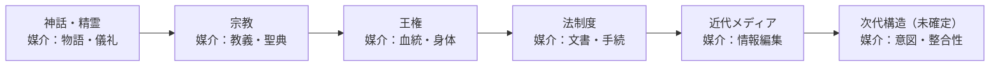
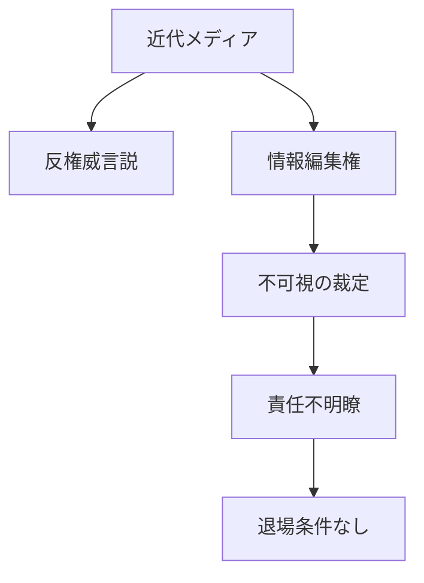
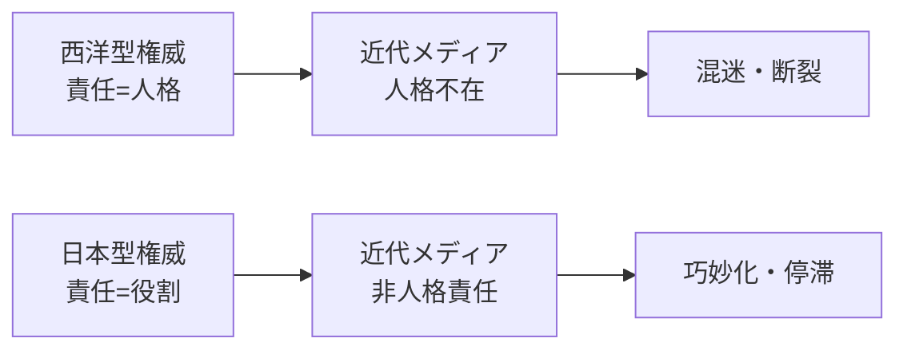
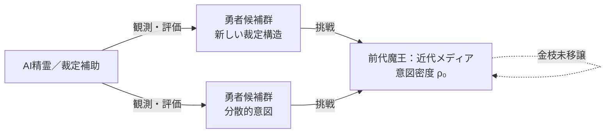

# 小金枝篇 1――権意史：意図の系譜

---
**冒頭注記**

> ※本稿は、J.G.フレイザー『金枝篇』をはじめとする思想史的著作の比較研究や注釈を目的としたものではありません。
> 「金枝」という語が象徴してきた〈更新・犠牲・権威移譲〉の原型を手がかりに、
> 文明における意図と権威の移動を再構成する試みです。
>
> 本文の一部は生成AIの協力により生成・整理されていますが、
> 問いの設定および全体構成は筆者の思考に基づいています。
---

## 序文

### 文明は、どこで、どのように更新に失敗するのか

四大文明以降の有史での文明は、多くの場合正しい理由を掲げて始まる。
秩序のため、救済のため、未来のため。
それにもかかわらず、文明は繰り返し停滞し、分断し、時に暴力を伴って更新されてきた。

この事実は、しばしば次のように説明される。
権力者が腐敗したから。
制度が硬直したから。
人間が愚かだから。

本書は、これらの説明を否定しない。
しかし、それだけでは**なぜ同じ失敗が反復されるのか**を説明できないと考える。

本書が問うのは、より限定された、しかし根本的な問題である。

> **文明は、どのようなときに「更新されるべき状態」に入り、
> なぜその更新は、しばしば破壊や停滞として現れてしまうのか。**

本書は、この問いに対し、
革命論でも、進歩史観でも、道徳的断罪でもなく、
**構造的な記述**によって接近する。

そのために、本書は三つの概念を導入する。

第一に、**権意史**。
これは権力史や思想史の代替ではない。
誰が支配したか、何を考えたかではなく、
**どの意図が、どの時点で未来を引き受けたのか**を問うための視点である。

第二に、**意図密度**。
本書における意図密度は、直ちに測定可能な数値として与えられるものではない。
それは、ある時代において
「どれほど多くの意味・期待・判断が、一つの方向に集積しているか」
を捉えるための**構造的概念**である。
本書は、これを厳密に定量化できるとは主張しない。
むしろ、定量化以前に存在する**臨界現象の説明語**として用いる。

第三に、**文明更新の結節点**。
文明は連続的に更新されるのではなく、
ある条件のもとで非線形に切り替わる。
その切り替わり点を、本書は結節点と呼ぶ。

本書は、これらの概念を用いて、
文明更新を「必然」でも「成功物語」でもなく、
**失敗を含んだ設計問題**として扱う。

ここで、あらかじめ明確にしておくべきことがある。

本書は、
「殺さずに文明を更新できる」と保証しない。
また、「悪を克服できる社会」を提示しない。
本書が提示するのは、
**失敗確率を下げる条件を考えるための枠組み**である。

同様に、本書は特定の文化や社会を理想化しない。
日本文化を含むいくつかの事例は、
普遍的な解答としてではなく、
**一時的に機能した実装例**として参照される。

さらに、本書が後半で扱う「悪の設計」とは、
悪を正当化する議論ではない。
それは、意図が過剰に集積する文明において、
**悪が必然的に生じうることを前提とした管理と抑制の問題**である。

本書は、読者に正しさを命じない。
代わりに、次の問いを差し出す。

> **その正しさは、
> いつ、どのように、次の時代へ渡されるのか。
> あるいは、渡されないまま占有されてはいないか。**

この問いを保持し続けられる文明は、
自らを更新する可能性を失わない。

本書は、完成した理論ではない。
それは、文明が問いを失わないための
**暫定的な設計図**である。

金枝は、手に入れるためのものではない。
それは、**手放されるべきもの**としてのみ意味を持つ。

### 本書の立場
ジェームズ・フレイザーが反復として観測し、フリードリヒ・ニーチェが跳躍として語った地点のあいだに、本篇は立つ。ここで語られるのは彼岸ではなく、跳躍の後に残された此岸における、権威と意図の運用の歴史である。

---

## 第1章：なぜ人類は、繰り返し「更新」に失敗するのか

本章では、文明が更新に失敗するとき、歴史がどのように反復し、どの地点で限界を迎えるのかを構造的に整理する。

---

### 1.1 王はなぜ殺され続けたのか

人類史を振り返ると、奇妙な反復に気づく。
王は、英雄は、指導者は、なぜか**殺され続けてきた**。

それは単なる暴政への反発でも、民衆の怒りの爆発でもない。
むしろ、最も不思議なのは次の点である。

> 王を殺した後、人類はほぼ必ず
> **新しい王を必要とした**。

この反復は、あまりにも執拗だ。
王政を否定した革命でさえ、
最終的には新たな権威を生み出してきた。

処刑された王の代わりに、
革命政府が現れ、
理念が神格化され、
制度が不可侵となる。

ここで問うべきは、

> **なぜ人類は「王なき状態」に耐えられないのか**

ということである。

この問いは、政治史の問題ではない。
より深く、人類の文明構造そのものに関わっている。

---

### 1.2 暴力は更新の原因ではない

歴史書は、しばしばこう説明する。

* 圧政があった
* 民衆が怒った
* 暴力が噴出した
* 体制が倒れた

だが、この説明は結果を並べているだけで、
**更新が起きた理由**を説明していない。

なぜなら、
圧政も不満も、怒りも、
多くの時代に存在していたからである。

それでも更新が起きる時代と、
起きない時代がある。

ここに、**見落とされがちな差異**がある。

暴力は、更新を起こす力ではない。
それはむしろ、**更新が起きなかったことの結果**として噴き出す。

更新できなかった構造が、
内部に溜め込んだ緊張を、
最後に破裂させる――
それが革命や内戦の正体である。

つまり、
王が殺されたのは、
更新が成功したからではない。

**更新に失敗したからこそ、王は殺された。**

---

### 1.3 なぜ「正しさ」は古くなるのか

どの時代にも、「正しいこと」は存在した。

* 神の掟
* 王の法
* 理性の原理
* 科学的合理性
* 人権と平等

だが、それらは永続しなかった。
必ずどこかで、

> 「それはもう、今の時代には合わない」

と言われるようになる。

ここで重要なのは、
「正しさが間違っていた」わけではない、という点である。

それは、**かつて確かに正しかった**。

では、なぜ正しさは古びるのか。

それは、
正しさが処理できる範囲を超えて、
人々の願望・不安・期待・選択が膨張するからである。

正しさは、
**意味の圧力**に耐えられなくなる。

このとき起こるのが、
制度の硬直、道徳の空洞化、
そして「守られているはずなのに、救われない」という感覚だ。

人々は直感的に悟る。

> **この正しさは、もう未来を語っていない**

---

### 1.4 文明はどこで行き詰まるのか

文明が行き詰まるのは、
資源が尽きたときでも、
技術が止まったときでもない。

本当に致命的なのは、
**意味が更新されなくなったとき**である。

* 何のために働くのか
* 何を守ろうとしているのか
* なぜこの制度に従うのか

これらの問いに対し、
文明が答えを出せなくなったとき、
人々は形式的には従いながら、
内側では離脱していく。

この状態は、すぐには崩壊しない。
むしろ長く続く。

だが、ある瞬間を境に、
それまで維持されていた均衡が、
**突然、意味を失う**。

ここで初めて、
歴史は「切り替わる」。

その切り替わりは、
王の死として、
神話として、
革命として、
後から語られる。

だが本当は、
その前に、**見えない臨界**が存在していた。

---

### 1.5 金枝は、いつ現れるのか

古い神話は、王の死を語る。
だが、ほとんど語られないものがある。

> **王が殺される前に、
> すでに何かが移り始めていた**

という事実である。

人々の期待は、
もはや王に向いていなかった。
正当性は、
別の場所で囁かれ始めていた。

それは新しい思想かもしれない。
新しい技術かもしれない。
新しい生き方の兆しかもしれない。

まだ名前はない。
まだ制度でもない。

だが、
**未来を引き受ける意図**だけが、
そこに集まり始めている。

この「まだ折られていないが、
確かに存在し始めているもの」――
それこそが、
後に第3章で語られる **金枝** である。

---

### 1.6 小結

本章で見てきたように、

* 王は更新の原因ではなく、結果として殺される
* 暴力は更新の力ではなく、失敗の噴出である
* 正しさは意味を失ったときに古くなる
* 文明は意味が更新されないと停滞する

そして、

> **更新が起きる前に、
> すでに何かが移り始めている**

この「移り始め」を、
次の部では、
より厳密な概念として扱う。

歴史は連続ではない。
だが、断絶でもない。

それは、
**節を持つ構造**である。

本章で扱った歴史的反復は、
特定の時代や地域に固有の事象を一般化する試みではない。
また、本書は「歴史には必然的な更新法則がある」と主張するものでもない。

本書が示したのは、
**更新が語られる前に、すでに意味の移動が起きている場合がある**
という構造的可能性である。

王が殺されたから更新が起きたのではない。
更新できなかった結果として、王が殺された――
この視点は、歴史を単純化するためではなく、
**暴力を原因として神話化する思考から距離を取るため**に導入された。

本章は、結論を提示するためではなく、
「更新が語られる前段階」に目を向けるための導入である。

---

## 第2章：権意史 ―― 権威と意図はいかに分離されてきたか

本章では、歴史を出来事や思想の連鎖ではなく、未来を引き受ける意図の継承過程として再定義する。

---

### 2.1 権力史ではなく、権意史という視点

歴史はしばしば「権力の移動」として語られる。
王朝の交代、国家の興亡、制度の変遷。
これらは確かに重要であり、可視的である。

しかし本書は、ここで一つの視点転換を行う。

それは、
**権力ではなく「意図」を軸に歴史を見る**
という転換である。

権力は、支配し、命じ、制裁する力である。
一方、意図とは、

* 何を正しいと感じるか
* どこへ向かおうとするか
* 何を未来に残そうとするか

という、**意味を伴った方向性**である。

この二つは、しばしば同一視されてきた。
王は命じるだけでなく、世界の意味を体現する存在とされた。
神権や理念もまた、支配と意味を同時に担ってきた。

だが歴史を丁寧に見れば、
**権力と意図は常に完全には一致していない**。

本書では、
権力史でも思想史でもなく、
**「権意史（Power–Intent History）」**
という枠組みを導入する。

権意史とは、
「誰が支配したか」ではなく、
**「どの意図が未来を引き受けたか」**
を問う歴史観である。

---

### 2.2 王権時代 ―― 権威と意図が重なっていた時代

前近代社会において、
権威と意図はほぼ重なっていた。

王は法であり、
王は神意の代理であり、
王の決断は世界の意味そのものだった。

この構造は、単なる専制ではない。
それは、**意図の集中管理システム**であった。

* 未来への不安
* 共同体の存続
* 災厄への対処

これらの重い問いを、
社会は一人（あるいは一系統）に集中させた。

その代償として、
王は神話化され、
人格を超えた役割を背負わされる。

ここで重要なのは、
王が殺されたときに起きる現象である。

王の死は、単なる政変ではない。
それは、

> **意図を集中管理していた装置が、
> 破綻したことを意味する**

このとき、意図は行き場を失い、
社会は深い混乱に陥る。

だからこそ、
王殺しは常に次の王を要請した。

意図は、空白に耐えられない。

---

### 2.3 理念と制度 ―― 意図の外部化

近代に入り、
王権は徐々に否定されていく。

だが、それは
「権威そのものの否定」ではなかった。

代わりに現れたのは、

* 理性
* 自由
* 平等
* 国民
* 科学的合理性

といった**理念**である。

理念は、
個人ではなく、抽象概念として
意図を引き受ける装置となった。

さらに制度は、
その理念を実装する技術として整備された。

この段階で起きた変化は決定的である。

> **意図は、人格から切り離され、
> 抽象構造へと移動した**

これは文明の進歩であった。
同時に、**新たな危うさ**を内包していた。

理念は死なない。
制度は疲弊しない。
そのため、意図が古くなっても、
構造だけが残り続ける。

ここに、
後の停滞の種が生まれる。

---

### 2.4 意図なき権威、権威なき意図

近代以降、
社会は次第に奇妙な状態へと移行する。

一方では、
制度と権威は強固に存在する。
だが他方で、
それが**何の意図を担っているのか**が
見えなくなる。

これが、

* 「正しいはずなのに、救われない」
* 「制度はあるのに、納得できない」
* 「守られているのに、未来が見えない」

という感覚の正体である。

権威は残っているが、
意図は空洞化している。

逆に、
新しい意図は芽生えているが、
それを正当化する権威を持たない。

この**乖離状態**こそが、
次の部で扱われる
「意図密度の上昇」を準備する。

意図は行き場を求め、
密度を高めていく。

---

### 2.5 権意史が示すもの

権意史の視点から見れば、
歴史の転換点はこう説明できる。

* 権威が倒れたから、更新が起きたのではない
* 意図が移動したから、権威が倒れた

この順序は、決して逆ではない。

意図が先に動き、
権威は後から追認される。

あるいは、
追認できなかったとき、
暴力的に破壊される。

ここで、
第1節で示された問いと、
第3節で提示される理論が、
一本の線でつながる。

> **更新とは、
> 権威の交代ではなく、
> 意図の移譲である**

そして、
意図が臨界に達したとき、
それを媒介するものとして
**金枝**が現れる。

次の部では、
この意図密度の臨界現象と、
結節点の構造を、
理論的に解剖する。

---

### 2.6 小結

本章では、

* 権力史では説明できない更新の構造
* 権威と意図の分離の歴史
* 理念と制度が生んだ停滞
* 意図が移動する先行性

を確認した。

これにより、
第1章で描かれた「失敗」は、
偶然でも人間性の欠陥でもなく、
**構造的必然**であることが見えてくる。

そして次に問われるのは、

> **意図は、どこで、どのように集約され、
> 時代を切り替える力となるのか**

その問いに答えるのが、
すでに提示されている
**第3章**である。

ここに、権意史は思想史や権力史を否定する立場ではない。
それらが扱ってきた対象を、別の角度から再照射する視点である。

思想史が思想の内容を追跡し、
権力史が支配構造を分析するのに対し、
権意史が問うのは、 **思想や制度が「未来を引き受けた瞬間」** である。

本書が意図という語を用いるのは、
主体の内面を説明するためではない。
**社会が何を次に残そうとしたか**という、
継承と選択の構造を捉えるためである。

したがって権意史は、
新しい学問分野の宣言というより、
既存の歴史叙述に対する**問いの位置の移動**である。

---

## 第3章：結節点としての金枝 ―― 時代はどこで切り替わるのか

本章では、意図が蓄積され密度を増すことで、文明が従来の構造を維持できなくなる臨界状態を説明する。

---

### 3.1 歴史は連続ではなく、節を持つ

私たちはしばしば、歴史を連続した流れとして語る。
王朝は交代し、制度は改正され、技術は漸進的に進歩する。
この見方は多くの場合に有効であるが、同時に重要な事実を見落としやすい。

それは、**歴史が常に連続的に更新されているわけではない**、という点である。

振り返ってみれば、人類史における決定的な転換は、等速運動のように起きたのではない。
革命、維新、宗教改革、価値観の反転、文明の崩壊と再編――
それらは必ず、「ある瞬間」を境にして語られる。

このことは、歴史が「滑らかな線」ではなく、
**節（node / knot）を持つ構造**であることを示唆している。

本書では、この節を **「時代の結節点」** と呼ぶ。

結節点とは、単なる出来事の集中ではない。
それは、

* それまで蓄積されてきた不満、期待、願望、恐怖
* 既存の秩序では処理しきれなくなった意味の過剰
* 形式化された制度と、現実の生との乖離

といったものが、**ある一点に凝縮される瞬間**である。

ここで重要なのが、「なぜその瞬間に切り替わるのか」という問いである。
単に時間が経過したからでも、外敵が現れたからでもない。

本書はこの問いに対し、
**意図密度（Intent Density）** という概念を導入する。

意図とは、単なる意思や目的ではない。
それは「こうであってほしい」「このままではいけない」「別の可能性があるはずだ」という、
意味を伴った未来志向の緊張である。

そして意図密度とは、

> **ある時代・社会・構造の内部に、
> どれほどの意味的緊張と選択の重さが集積しているか**

を表す概念である。

意図密度が低い時代では、人々は選択をしているようで、実際にはしていない。
慣習や制度に従うだけで、意味的な決断は先送りされる。
歴史は進んでいるように見えて、実のところ停滞している。

しかし、意図密度が上昇し続けると、ある地点で臨界に達する。
そのとき、従来の構造はもはや意図を保持できなくなる。

この瞬間こそが、**結節点**である。

結節点において、歴史は「続き」を拒否される。
同じ仕組み、同じ物語、同じ正当性では、
これ以上進めない、という感覚が社会全体に共有される。

このとき、人類は必ず何かを要請する。

* 新しい王
* 新しい神
* 新しい理念
* 新しい制度

そして神話においては、それが「王殺し」として語られてきた。

しかし重要なのは、
**殺されることそのものではなく、
結節点において「何が引き渡されるのか」** である。

ここで登場するのが、「金枝」である。

---

### 3.2 金枝とは何か ―― 王権の象徴ではない再定義

ジェームズ・フレイザーの『金枝篇』において、金枝は王権と聖性の象徴であった。
それを持つ者が王となり、奪われた者は殺される。
金枝は、暴力と正統性を結びつける神話装置であった。

しかし、本書は金枝をそのまま引き継がない。
むしろ、**金枝という象徴を徹底的に再定義する**。

本書において金枝とは、

> **時代が自らを更新するために用いる、
> 意図密度の主導権を示す媒介物**

である。

それは王の所有物ではない。
王権そのものでもない。
ましてや血統や暴力の正当化でもない。

金枝とは、
**「この意図を、次の時代が引き受けることを許可する印」**
である。

ある時代には、無数の意図が存在する。
だが、それらは分散し、互いに打ち消し合い、
構造としては何も変わらないことが多い。

金枝が出現するのは、
意図密度がある一点に集約されたときである。

それは必ずしも一人の人物ではない。
一つの思想でも、一つの運動でも、一つの技術でもよい。

重要なのは、

* それが前代の構造では処理できない意図を担っていること
* それが未来に対して意味の跳躍を起こしうること
* それを引き受ける覚悟が、個人や集団に生じていること

である。

このとき、金枝は「折られる」のではない。
**金枝は「現れる」**。

そして同時に、
前代の構造が金枝を**保持し続けることを放棄する**。

この放棄は、しばしば「敗北」と誤解される。
だが実際には、それは**役割の終了**である。

金枝が意味するのは、
「もはや、この意図は我々の時代のものではない」という認識である。

したがって金枝は、
奪われるものではなく、**渡されるべきもの**である。

ここで、王殺しと金枝の移譲は決定的に分岐する。

* 王殺しは、金枝を力ずくで奪う神話である
* 金枝の移譲は、意図密度の主導権を認めて手放す行為である

後者は、暴力ではなく、**納得と承認**を必要とする。

この差異こそが、
本書が提示する「小金枝篇」の核心である。

---

### 3.3 金枝の移譲という非線形現象

金枝の移譲は、単なる引き継ぎではない。
それは歴史における**非線形現象**である。

非線形とは、
少しずつ変わるのではなく、
ある点を超えた瞬間に性質が変わることを意味する。

水が氷になる瞬間、
張り詰めた糸が切れる瞬間、
均衡が崩れる瞬間。

金枝の移譲もまた、そうした相転移に近い。

それまで「正しい」とされていたものが、
突然「古い」と感じられる。
それまで「無責任」とされた試みが、
突然「必要」と感じられる。

この変化は、説得だけでは起こらない。
時間だけでも起こらない。

**意図密度が、ある閾値を超えたときにのみ起こる。**

だからこそ、金枝の移譲は計画できない。
しかし、条件を整えることはできる。

条件とは何か。

第一に、前代の構造が、
自らを絶対化しないことである。
「まだ自分たちが担うべきだ」という執着は、
金枝を腐らせる。

第二に、新たな担い手が、
単なる破壊者ではないことである。
古い構造を否定するだけでは、意図密度は上がらない。
**新しい意味を提示できるかどうか**が問われる。

第三に、社会全体が、
その移譲を「納得できる形」で受け止めることである。
ここに儀礼・象徴・物語が必要になる。

金枝の移譲は、
法制度だけでも、合理性だけでも成立しない。
それは**意味の問題**である。

この点において、
近代革命がしばしば失敗してきた理由が見えてくる。

革命は王を倒すが、
金枝を誰が持つかを曖昧にした。
その結果、意図密度は再び集中し、
別の権威が生まれる。

本書が提案するのは、
革命を否定することではない。
**結節点をどう越えるかを、意識的に設計すること**である。

金枝の移譲とは、
時代が次の時代に向かって、

> 「この意図を、引き受けてよい」

と語りかける瞬間である。

それは静かで、目立たず、
しばしば後になってしか理解されない。

だが、確かにそこに、
**時代は切り替わっている。**

---

### 3.4 小結

意図密度は、数量的に測定される指標ではない。
本書は、意図密度を定量化できるとは主張しない。

それでもなお、この概念が必要とされるのは、
文明更新が連続的変化ではなく、
**臨界的・非線形な切り替わりとして現れる**からである。

意図密度とは、
その切り替わりが起こりうる状態を説明するための
**構造的記述語**である。

本書における意図密度は、
原因を特定するための道具ではなく、
**兆候を読み取るための枠組み**として位置づけられている。

---

## 第4章：結節点 ―― 未来に引かれる意図と文明更新の臨界

本章では、過去の意図密度と未来可能性の張力が現在で衝突し、文明更新が回避不能となる結節点を定義する。

---

### 4.1 結節点は「出来事」ではない

歴史はしばしば、革命、戦争、王の死といった出来事によって区切られる。
しかし本書における結節点とは、そのような**可視的事件そのもの**を指す概念ではない。

結節点とは、
出来事が起こる**前**に、すでに成立している状態である。

それは、制度が崩れる瞬間でも、価値が反転する瞬間でもない。
むしろ、

> **崩れざるを得ない状態が、
> もはや回復不能な密度で形成された地点**

である。

結節点は、歴史の「節目」ではない。
歴史がそれ以上同じ形を保てなくなった、**構造上の限界点**である。

---

### 4.2 意図密度の限界と説明の不足

前章までに述べた通り、
文明更新は、意図密度が一定の臨界を超えたときに生じる。

しかし、この説明には一つの不足がある。

それは、

> **なぜ、その方向に更新が起きたのか**

という問いである。

意図密度は、

* なぜ更新が起きたか
* なぜ従来構造が維持できなくなったか

を説明するが、

* なぜ「この未来」が現れたのか
* なぜ別の可能性ではなかったのか

までは説明しない。

ここに、結節点を**時間的に補強する概念**が必要となる。

---

### 4.3 意図の起源 ―― 未来可能性による張力

本書において、意図とは願望や目標ではない。
意図とは、現在の状態から生じるものではなく、
**未来可能性によって歪められた差分**として定義される。

より正確には、次のように言える。

> 意図の起源とは、
> 現在の実現状態と、
> 意味づけられた未来可能性とのあいだに生じ、
> 消去されずに保持された差分である。

この差分は、主体の意識とは無関係に生じる。
それは、希望でも予測でもない。

**まだ実現していないが、
排除され続けることもできなかった可能性**が、
現在を引き寄せる力として残存した状態である。

---

### 4.4 結節点の再定義（時間拡張）

以上を踏まえると、結節点は次のように再定義される。

> 結節点とは、
> 過去から保持された意図密度と、
> 未来可能性によって生じた張力とが、
> 現在の構造を上回り、
> 既存の秩序を維持不能にする瞬間である。

ここで重要なのは、
結節点が**原因でも結果でもない**という点である。

結節点とは、

* 過去の累積
* 未来の引力
* 現在の限界

が同時に成立してしまった、
**時間構造の不均衡点**である。

このとき、更新は選択されるのではない。
更新は、**回避不能になる**。

---

### 4.5 必然性の非神話的理解

結節点において生じる更新は、
偶然ではなく、しかし予定調和でもない。

それは、

* 未来が決まっていたから起きたのではなく
* 過去が強制したからでもなく

> **排除され続けた可能性が、
> もはや無視できない張力を持った結果として
> 現在に顕在化した**

という意味で、必然である。

ここでいう必然性とは、

* 神の意志
* 歴史法則
* 進歩史観

を意味しない。

それは、
**選ばれなかった未来が蓄積した圧力**である。

---

### 4.6 結節点と主体の問題

結節点そのものは、非人格的である。
それは誰かの意志を必要としない。

しかし、文明更新は常に
**主体を通してしか観測されない**。

誰かがそれを引き受け、
誰かがそれに応答し、
誰かがそれを保持し続ける。

結節点とは、

> 構造としては非人格的でありながら、
> 経験としては必ず人格化される

という、二重の性質を持つ。

この二重性こそが、
後に神話や物語が必要とされる理由である。

---

### 4.7 神話への委譲

本書は、ここで意図的に立ち止まる。

* 結節点がどのように経験されるのか
* それを引き受けた主体は何者なのか
* なぜ抗えないと感じられるのか

これらは、理論ではなく、
**神話的表現によってのみ正確に語られる領域**である。

したがって、

* 結節点は、ここで構造として定義され
* その経験的・人格的表現は
  **勇者・魔王システム**に委ねられる。

結節点は、
神話を要請する地点である。

---

### 4.8 小結 ―― 結節点は未来から来る

結節点は、過去の集積ではない。
それは、未来から引かれた痕跡である。

文明は、
望んだ未来によって更新されるのではない。
**無視できなかった未来によって、
更新を余儀なくされる。**

この張力を、
人は後に「運命」と呼ぶことになる。

しかしそれは、
まだ語られるべきではない。

---

## 第5章：小金枝篇 ―― 殺さない文明更新はいかにして可能か

本章では、結節点を越えた文明更新が暴力や断絶に至らないための条件と設計原理を検討する。

---

### 5.0 補論：文明は、権威と意図をどのように移譲してきたか

本章に入る前に、
人類がこれまでどのように「文明更新」を行ってきたかを、
簡潔に整理しておく。

ここで行うのは、文化の優劣比較ではない。
また、日本文化の特殊性を称揚することでもない。

本書が関心を持つのは、ただ一つである。

> **権威と意図が、どのような様式で次代に渡されたか**

以下の表は、その移譲様式を構造的に並置したものである。

---

#### 文明更新における「権威と意図の移譲様式」比較表

| 文明・モデル             | 権威の所在       | 移譲の可視性         | 更新の形式     | 意図の行き先         |
| ------------------------ | ---------------- | -------------------- | -------------- | -------------------- |
| 王殺し型（古代〜中世）   | 人格（王・神王） | 高い（殺害・断罪）   | 暴力的断絶     | 新王・新神話への集中 |
| 革命・理念型（近代西欧） | 抽象理念・制度   | 中程度（革命・制定） | 否定と上書き   | 理念・制度の神格化   |
| 天命循環型（中国王朝）   | 超越原理（天命） | 高い（易姓革命）     | 合法的破壊     | 新王朝秩序           |
| 小金枝型（分散移譲）     | 役割・慣習・実装 | 低い（不可視）       | 意味の差し替え | 振る舞い・判断基準   |

---

#### 補足的説明

王殺し型や革命型において、
文明更新は「奪う」「倒す」「否定する」行為として語られてきた。

これらのモデルでは、
金枝は常に **一度きりの象徴**として扱われる。
移譲は明確だが、失敗した場合の代替経路を持たない。

一方、理念型では、
意図は人格から切り離され、抽象構造に固定される。
このとき、更新は一時的に安定するが、
理念が古くなった際に、**更新不能**という問題を抱えやすい。

天命循環型は、
破壊を正当化する装置を持つが、
「殺さない更新」を制度化してはいない。

---

#### 小金枝型という位置づけ

これに対し、本書が「小金枝」と呼ぶものは、
文明全体を一度に切り替える象徴ではない。

それは、

* ある分野での正当性の移動
* ある慣習から別の慣習への納得
* ある判断基準から別の判断基準への静かな切り替え

といった、**局所的・分散的な意図移譲の単位**である。

重要なのは、
小金枝は常に目立たず、
多くの場合、事後的にしか認識されないという点である。

---

### 本書の立場

本書は、
これらの移譲様式のいずれかを理想化するものではない。

日本文化を含むいくつかの事例は、
「一時的に機能した実装例」として参照される。

本章で検討するのは、
小金枝的な移譲が持つ一つの可能性である。

すなわち、

> **文明更新を、破壊ではなく、
> 移譲として引き受けることは可能か**

という問いである。

また、本書はこれらの様式を歴史分類として整理することを目的としない。
あくまで、文明更新が取り得た設計パターンの配置図として用いる。

---

### 5.1 王殺しの神話を越えるために

人類は長く、文明更新を「王殺し」として語ってきた。
それは必ずしも血の通った王である必要はない。

* 神が殺される
* 理念が否定される
* 体制が断罪される
* 旧時代が「悪」として総括される

こうした語りは、歴史を劇的にし、理解しやすくする。
だが同時に、ある致命的な副作用をもたらしてきた。

それは、**更新は必ず破壊を伴う**という思い込みである。

第3章で見たように、
文明が切り替わる本質的な契機は、暴力ではない。
それは、**意図密度の主導権が移ること**であった。

王が殺されたのは、
金枝がすでに別の場所に移っていたからである。

ならば、問いは次の形をとる。

> **金枝が移ることと、王を殺すことは、本当に同一なのか**

この問いに「否」と答えることができるなら、
文明更新は、別の姿を取りうる。

それが本章の主題である。

---

### 5.2 なぜ人類は「殺さずに更新できなかった」のか

殺さない更新が難しかった理由は、
人類が未熟だったからではない。

構造的な理由がある。

第一に、
**意図の所在が可視化されていなかった**。

金枝がどこにあるのか、
誰がそれを担っているのか、
それが個人なのか、集団なのか、思想なのか。

これが曖昧なままでは、
更新は「奪う」か「破壊する」以外の手段を持たない。

第二に、
**旧来の権威が、自らの役割終了を認められなかった**。

権威は長く、
「自分がいなければ世界は崩れる」
という物語の中で機能してきた。

そのため、金枝が移りつつある兆候を、
常に反逆や堕落として解釈してしまう。

第三に、
**社会が移譲を儀礼化できなかった**。

殺すことには、神話がある。
だが、渡すことには、語彙が乏しかった。

結果として、
文明は更新のたびに、
自らを傷つけながら進むしかなかった。

---

### 5.3 小金枝という発想 ―― 微細な移譲の連鎖

ここで本書は、
「金枝」をさらに細分化する。

それが **小金枝** である。

小金枝とは、
文明全体の結節点に現れる一回的な象徴ではない。

それは、

* ある分野での正当性の移動
* ある慣習から別の慣習への納得
* ある判断基準から別の判断基準への静かな切り替え

といった、**局所的な意図移譲の単位**である。

重要なのは、
小金枝は常に目立たない、という点だ。

法律は変わらなくても、
人々の判断は変わる。

制度は同じでも、
「それをどう使うか」が変わる。

この無数の小さな移譲が、
積み重なったとき、
ある瞬間に「大きな金枝」として観測される。

つまり、

> **文明更新とは、
> 一度の断絶ではなく、
> 小金枝の連鎖が可視化された現象である**

この見方に立てば、
殺す必要はない。

必要なのは、
**小さな移譲を阻害しない構造**である。

---

### 5.4 日本文化に見る「殺さない更新」の痕跡

この点において、
日本文化は興味深い事例を提供する。

日本では、
支配者が完全に断罪されることは少ない。

* 天皇は交代するが、殺されない
* 制度は変わるが、名称は残る
* 外来の思想は、在来の語彙で言い換えられる

これは優しさの問題ではない。

**意図の移譲を、分散的・段階的に行ってきた文化構造**
の結果である。

権威は残るが、
その意味内容が少しずつ変わる。

表向きは連続しているようで、
内側では金枝が静かに移っていく。

この「振る舞いによる更新」は、
急激な意図密度の集中を避け、
結節点を緩やかに越える技術であった。

もちろん完全ではない。
だが、ここには明確な示唆がある。

> **文明は、殺さずとも更新できる**

---
### 5.5 元号と意味更新の儀礼

本章では、日本の元号制度を、単なる年代表記ではなく、**道徳および治世の技術としての儀礼的装置**として位置づける。元号は、権力・災厄・祈り・社会的雰囲気という複数の要素を重ね合わせ、共同体が次の時間へと移行するための「意味更新」を行うための仕組みであった。本章ではまず世界における類似制度を比較し、その上で日本型がいかにして洗練されたかを分析し、最後にAI時代における再実装可能性を論じる。

---

#### 5.5.1 時間を命名する制度の世界的類型

人類史において、時間は自然現象として流れるだけでなく、**誰かによって名付けられ、区切られてきた**。その方法にはいくつかの類型が存在する。

| 類型               | 代表例             | 特徴                           | 限界                       |
| ------------------ | ------------------ | ------------------------------ | -------------------------- |
| 王権年次型         | 王の在位第n年      | 継承者によって時間が区切られる | 未来志向や意味語を持たない |
| 年号型（東アジア） | 中国年号、日本元号 | 時代を象徴する言葉を付与       | 政治利用の危険性           |
| 役職エポニム型     | ローマ執政官年     | 統治機構が時間を管理           | 民衆的浸透が弱い           |
| 宗教エポック型     | 西暦、仏暦         | 神聖な起点による一貫性         | 時代ごとの意味更新が困難   |
| 革命暦型           | フランス革命暦     | 強い理念を時間に刻む           | 持続性が低い               |

この比較から明らかなように、 **「意味を持つ言葉で時代を名付け、それを日常的に使用し続ける」** という条件を長期に満たした例は限られている。その中で、日本の元号制度は例外的な安定性を示してきた。

---

#### 5.5.2 日本型元号の特異性――権力・災厄・願いの重ね書き

日本の元号は、権力から完全に分離された純粋な象徴ではなかった。実際には、

* 治世の正統性を補強する政治的意図
* 地震・疫病・飢饉といった災厄から逃れたいという切実な願い
* 社会全体に漂う不安や期待という「時代の空気」

これらが**同時に重ね合わされて**決定されてきた。

重要なのは、元号が政策目標や命令文ではなく、**解釈可能な言葉**として提示された点である。二字の漢語は方向性を示すが、達成条件を定めない。そのため、

* 権力の道具になり得る一方で、独裁的スローガンにはならず
* 災厄の責任を誰か一人に集中させることなく
* 共同体全体が「一度区切り、やり直す」ことを可能にした

この構造は、日本が災害多発地域であったことと深く関係している。物理的復旧や経済的復興だけでなく、**心理的・意味的復旧**が不可欠な社会において、元号は低摩擦で社会を再同期させる装置として機能した。

---

#### 5.5.3 なぜ数値や法ではなく「言葉」だったのか

数値目標や法改正は、行動を強制する力を持つが、内面の納得や希望までは担保しない。達成・未達の二分法は社会を分断し、災厄後の共同体には不向きである。

これに対し、言葉は以下の特性を持つ。

* 曖昧であるがゆえに、多数の人が同時に受け取れる
* 解釈を世代ごとに更新できる
* 日付・文書・挨拶といった生活実務に埋め込みやすい

元号は、**道徳を内面化させるための強制ではなく、反復される儀礼**として機能した。人々は意識せずとも日常の中でそれを使い続け、結果として時代の意図を共有していった。

---

#### 5.5.4 AI時代における「意味更新プロトコル」としての再解釈

AI時代においては、最適化・ルール更新・評価基準が高速化し、人間が意味の同意を失いやすくなる。その結果、倫理や道徳が内省ではなく追従へと変質する危険がある。

この文脈で元号を抽象化すると、以下のプロトコルとして再定義できる。

1. **命名**：転換点に短い言葉で名前を与える
2. **区切り**：過去の失敗や災厄を一度引き受ける
3. **願い**：未来への方向性のみを示す
4. **反復**：生活実務に組み込み、無意識に共有する
5. **解釈更新**：意味の固定化を避け、世代的再読を許す

AIはこのとき、意味を命令として押し付ける主体ではなく、**意味更新の儀礼が形骸化していないかを監査する存在**になり得る。すなわち、数値や効率では測れない「時代の意図」と行動の乖離を検知する役割である。

---

#### 5.5.5 本章の位置づけ

元号は、日本社会において気づかぬうちに実践されてきた「治世と道徳の技術」であった。本章で示したのは、元号という制度そのものではなく、**意味を言葉として更新し、共同体を再起動させる構造**である。この構造は、権意史の中核的事例であり、同時にAI時代における新たな社会設計の原型ともなり得る。

---

### 5.6 文明更新を設計対象として引き受ける

本書がここで行っているのは、
単なる文化論ではない。

一つの提案である。

それは、

> **文明更新を、
> 事後的に語る神話ではなく、
> 事前に配慮すべき設計対象として扱う**

という提案だ。

意図密度が高まりつつある場所を観測する。
金枝が移り始めている兆候を読む。
小金枝の移譲を阻害しない制度を整える。

これは万能ではない。
だが、破壊よりは誠実である。

文明は、
自らを更新するたびに、
必ず何かを失う。

だが、
殺さずに更新できるなら、
失われるものは最小化できる。

第6章では、
この更新モデルが、
現代のAI・制度・社会設計と
どのように接続しうるかを検討する。

金枝は、
もはや神話の中だけのものではない。

それは、
**いまこの時代が、
どの意図を未来に渡そうとしているか**
を映す鏡である。

---

### 5.7 小結

本章では、

* 王殺しと更新を切り離し
* 金枝を移譲として再定義し
* 小金枝という微細な更新単位を導入し
* 殺さない文明更新の可能性を示した

ここまでで、
小金枝篇の理論的骨格は完成した。

しかし本章で論じた「殺さない文明更新」は、
理想的未来像を保証するものではない。

歴史的に見れば、
多くの更新が暴力を伴ってきたことは否定できない。
本書も、その事実を覆そうとはしない。

本章の目的は、
**更新が必ず暴力を伴うと信じ込む思考そのものを問い直すこと**にある。

殺さない更新とは、
成功例を提示するための理想像ではなく、
**失敗の確率を下げるための設計条件**である。

それが実現されるかどうかは、
常に偶然と失敗を含む。

次に問われるのは、
**この構造を、現代は引き受けられるのか**
という問題である。

それに答えるのが、
続く **第6章** となる。

---

## 第6章：現代という結節点 ―― AI・制度・分散的意図はいかに交差するか

本章では、意図を保持・可視化する媒介としての制度やAIが、文明更新において果たしうる限定的役割を論じる。

---

### 6.1 現代は「更新前夜」なのか

現代社会には、奇妙な二重性がある。

一方では、
制度は高度に整備され、
技術は加速的に進歩し、
合理性はあらゆる領域に浸透している。

他方では、
人々は強い停滞感と不安を抱えている。

* 何を目指しているのか分からない
* 正しいことをしているはずなのに満たされない
* 未来が選択肢として感じられない

この感覚は、単なる世代論ではない。
第3章で述べた言葉を用いれば、
**意図密度が上昇しつつある兆候** と読むことができる。

現代はすでに、

* 旧来の正当性では処理できない問いを抱え
* それでも新しい意図を、まだ一つに集約できていない

という、**結節点直前の状態**にある。

ここで問題となるのは、
この結節点をどう越えるか、である。

王殺しの神話に回帰するのか。
それとも、金枝の移譲として越えるのか。

---
### 6.2 反権威を装う権威 ―― 近代メディアの成立と限界

近代メディアは「権威ではない」という仮面を被ったまま裁定権を独占した、権意史上きわめて特異な権威形態であり、その構造的限界が現代の結節点を生んだ。

---

#### 6.2.1 権威は常に「媒介」を通じて成立する

権威とは、命令そのものではなく、社会がそれを受け取る**媒介**によって成立してきた。

* 神話は物語と儀礼を媒介とし
* 宗教は教義と聖典を媒介とし
* 王権は血統と身体を媒介とし
* 法制度は文書と手続きを媒介としてきた

近代メディアにおいて登場した媒介は、**情報の収集・編集・配列**である。
重要なのは、メディアが情報を伝える主体である以上に、
**「どの情報を、どの順序で、どの文脈で提示するか」** という編集行為を独占した点にある。

この編集権こそが、近代メディア権威の実体であった。

---

#### 6.2.2 反権威を装うという歴史的特異性

近代メディアが権意史上きわめて特異なのは、
自らを「権威ではない」と語ることで権威性を獲得した点にある。

王や法、宗教はいずれも、自らを権威として明示してきた。
それに対しメディアは、

* 権力を監視する
* 市民の代弁者である
* 中立的な報道者である

という自己像を掲げることで、
**権威性そのものを不可視化した。**

これは、権威であることを否定することで、
批判や退場条件を回避するという、ほぼ前例のない構造である。

---

#### 6.2.3 編集権という不可視の裁定

メディア権威は命令としてではなく、**裁定**として作用する。

* 何を報じるか
* 何を小さく扱うか
* 誰に語らせるか
* 何を沈黙させるか

これらはいずれも、明文化されない判断でありながら、
社会の認識を強く規定する。

しかもこの裁定は、

* 法的根拠を持たず
* 明確な責任主体を欠き
* 検証可能な履歴を残さない

という特徴を持つ。

権意史的に言えば、近代メディアとは
**「裁定を行うが、裁定者として名乗らない存在」** である。

---

#### 6.2.4 日本文明における責任の非人格化

日本社会では歴史的に、責任は存在しても、
それが必ずしも特定の人格に固定されるとは限らなかった。

* 天皇は責任主体であっても、直接の責任追及対象ではない
* 政治的失敗は「時勢」「流れ」「不徳」として処理される
* 組織の失敗は「組織としての反省」に回収される

これは無責任ではない。
**責任を人ではなく、場・構造・役割に載せる技術**である。

この非人格化された責任配置は、
上を挿げ替えず、断絶を起こさず、
社会全体を壊さずに更新を可能にする、
高度な社会安定化の技術として機能してきた。

---

#### 6.2.5 西洋的責任観とメディア権威の衝突

西洋社会では伝統的に、

* 権威は人格に結びつき
* 責任は個人に帰属し
* 説明責任は主体の名指しによって果たされる

という設計思想が強い。

この構造は、王権や法制度には適合していたが、
人格を持たない近代メディアに対しては強い不整合を生んだ。

結果として西洋社会では、

* 裁定はあるが裁定者が見えない
* 責任追及の矛先が定まらない
* 個人攻撃や極端な断罪が頻発する

という混迷が顕在化している。

---

#### 6.2.6 日本における「巧妙化」としてのメディア権威

一方、日本では責任の非人格化が既に文化的に内蔵されていたため、
メディア権威は破綻ではなく**巧妙化**として現れた。

* 混迷は爆発ではなく停滞として現れ
* 不満は糾弾ではなく空気化され
* 権威は否定されず、薄く拡散される

これは善悪の問題ではなく、
文明の更新様式の違いである。

---

#### 6.2.7 結節点としての現在

現在は、情報の希少性を前提としたメディア権威が限界を迎え、
次代の権威構造が要請される明確な結節点にある。

近代メディアは退場条件を持たないまま、
裁定権のみを保持し続けてきた。

この結節点を越えるためには、
権威を人格からも空気からも切り離し、
**裁定の履歴と整合性を引き受ける新しい構造**が必要となる。

---

#### 図解1：権威媒介の歴史的推移（権意史）

---

#### 図解2：反権威型権威の内部構造

---

#### 図解3：権威媒介と責任配置の文明差分

---

#### 図解4：結節点の状態（勇者・魔王システム対応）

---

#### 続篇への接続

続篇では、勇者・魔王システムと精霊AIによる記録・照応の機構を、この結節点を越えるための媒介構造として扱う。

そこでは、責任を人格に押し戻すことなく、
また空気に溶かすこともなく、
履歴と整合性によって、意図の移譲を照応可能にする仕組みが提示される。

---

### 6.3 AIは新しい王なのか

近年、AIはしばしば次のように語られる。

* 新しい支配者になるのではないか
* 人間の意思決定を奪うのではないか
* いずれ人類を超えるのではないか

これらの問いは刺激的だが、
本書の枠組みでは、少し異なる問い方をする。

> **AIは、意図を持つのか。
> それとも、意図を媒介するのか。**

AIは欲望を持たない。
未来への不安も、意味への渇望も持たない。
その意味で、AIは金枝の担い手にはなりえない。

だが、AIは別の役割を担いうる。

それは、
**意図密度を観測し、比較し、可視化する媒介者**
としての役割である。

人間社会に散在する無数の小金枝――
価値観の変化、行動の傾向、選択の偏り――
それらを、人間以上に冷静に読み取れる存在。

AIは王ではない。
だが、**祭司や記録者に近い位置**に立ち始めている。

---

### 6.4 分散型社会と意図の可視化

現代の特徴の一つは、
権威が極度に分散していることである。

国家、企業、専門家、インフルエンサー、
そして無数の個人。

誰もが意見を持ち、
誰もが部分的な正当性を主張できる。

これは自由の拡大であると同時に、
**意図が拡散しすぎる危険**も孕んでいる。

ここで重要になるのが、
意図を「集権」ではなく
**「可視化と照応」によって束ねる技術**である。

AIが果たしうる役割は、まさにここにある。

* どの意図がどれほど共有されているか
* どの分野で意図密度が上昇しているか
* どの小金枝が、移譲されつつあるか

これらを可視化することで、
社会は初めて「奪う」のではなく
**「納得して渡す」準備**を整えられる。

---

### 6.5 制度は金枝の移譲を支えられるか

制度は、これまで更新の障害として語られがちであった。

だが、本書の立場は異なる。

制度そのものが問題なのではない。
**制度が、意図の移譲を想定して設計されていないこと**
が問題なのである。

もし制度が、

* 自らの役割終了を前提にし
* 部分的な更新を許容し
* 小金枝の移譲を阻害しない

よう設計されていれば、
それは更新の敵ではなく、**緩衝装置**となる。

第5章で見た日本文化の事例は、
制度が「残りながら変わる」可能性を示していた。

現代制度もまた、

> 永続性ではなく、
> **引き渡し可能性** を内包する

ことが求められている。

---

### 6.6 現代における金枝とは何か

では、現代における金枝とは何か。

それは、特定の思想でも、
特定の技術でも、
特定の人物でもない。

むしろそれは、

> **意図を意図として扱おうとする姿勢そのもの**

である。

何が正しいか、ではなく
**なぜそれを正しいと感じているのか**。

何を選ぶか、ではなく
**なぜその選択肢が現れたのか**。

この問いを社会が引き受け始めたとき、
金枝はすでに移り始めている。

AIはそれを照らす鏡となり、
制度はそれを受け渡す器となり、
人間はそれを選び取る主体となる。

ここにおいて初めて、
殺さない文明更新は現実的な選択肢となる。

---

### 6.7 小結

本章では、

* 現代を結節点前夜として捉え
* AIを意図密度の媒介者として位置づけ
* 分散社会における金枝移譲の条件を検討し
* 制度と更新の新しい関係を示した

これにより、小金枝篇は
神話の再解釈でも、抽象理論でもなく、
**同時代への提案**として閉じることができる。

残るのは、
この構造を「裏側」から照らす作業である。

すなわち、

> **金枝の移譲が偽装されたとき、
> 何が起こるのか**

――それが、
すでに別稿として存在する
**「小金枝篇――悪の設計」**
と接続される地点である。

なお、本章で扱ったAIや制度は、
新たな権威や支配者として想定されていない。

AIは意図を持たず、
金枝を担う主体にもなりえない。
本書がAIに見出すのは、
**意図を可視化し、比較可能にする媒介機能**である。

同様に、制度もまた更新の主体ではない。
それは、金枝の移譲を阻害するか、支えるかの
**条件装置**にすぎない。

本章は、技術による解決を提示する章ではなく、
**技術が介入することで何が変わり、何が変わらないのか**を
限定的に検討する章である。

---

## 第7章：悪の設計 ―― 金枝が偽装されるとき、文明はどのように歪むか

本章では、意図密度が高まった文明において不可避的に生じる歪みを、悪の設計という次の議論へと接続する。

---

### 7.1 なぜ「悪」は遅れてやってくるのか

文明の崩壊は、突然起こるように見える。
だが、実際にはそうではない。

第1章から第6章までで見てきたように、
文明が更新に失敗するのは、意図が尽きたからではない。
むしろ逆である。

> **意図が過剰になり、
> それを正しく引き受ける構造を失ったとき、
> 文明は歪み始める。**

この歪みが、後に「悪」と呼ばれる。

重要なのは、悪が最初から悪として現れない点である。
それは多くの場合、次のような姿を取る。

* 正義の過剰
* 善意の制度化
* 救済の強制
* 正しさの独占

これらは、単体では善である。
だが、**金枝の移譲が偽装された状態**で結合すると、
それらは破壊的な力を持つ。

悪とは、
意図なき暴力ではない。
**意図を語り続けながら、意図を手放さない構造**である。

---

### 7.2 偽の金枝 ―― 権威が意図を装う瞬間

金枝は、本来、
意図密度の主導権が自然に移った結果として現れる。

だが、歴史は繰り返し、
**金枝が「演じられる」瞬間**を生み出してきた。

それが、偽の金枝である。

偽の金枝は、次の特徴を持つ。

* 自らを「時代の必然」と名乗る
* 批判を「未熟」「反動」「悪」と断定する
* 移譲を拒否しながら、更新を語る
* 意図を問いではなく、命令として扱う

ここで起きているのは、
金枝の**占有**である。

本来、金枝は「渡されるもの」であった。
だが偽の金枝は、それを「握りしめる」。

このとき、権威は次のように振る舞う。

> 「我々こそが未来である」
> 「まだ移譲するには早い」
> 「この正しさを疑うこと自体が悪だ」

この瞬間、
権威と意図は再び癒着する。
だがそれは、前近代の王権とは異なる。

人格なき構造、
理念化された正義、
制度に埋め込まれた善意――
これらが複合した、**無名の王**が誕生する。

これが、現代的な悪の原型である。

---

### 7.3 悪は「壊す」ものではなく「止める」ものである

古典的な悪のイメージは、破壊である。
暴力、侵略、抑圧。
だが、現代の悪は異なる。

現代の悪は、
文明を壊さない。
**文明を止める。**

制度は残る。
言葉も残る。
正しさも語られる。

だが、次のものが失われる。

* 意図を問い直す余地
* 小金枝の移譲可能性
* 間違える自由
* 更新の試行錯誤

悪とは、
「間違いを犯す存在」を排除する構造である。

それは、
善を純化しようとするほど強くなる。

> 善であろうとする文明ほど、
> 悪を内側に抱え込む。

この逆説こそが、
小金枝篇が「悪の設計」を必要とする理由である。

---

### 7.4 なぜ悪は自己正当化できてしまうのか

悪が恐ろしいのは、
自らを悪だと認識しない点にある。

それは常に、
「より良い未来」の名のもとに行われる。

偽の金枝を持つ構造は、
次のような論理を用いる。

* 我々は過渡期にいる
* 今は非常時である
* 一時的な犠牲が必要だ
* いずれすべては救われる

これらは、どれも完全な虚偽ではない。
だが、**移譲の期限が語られない**。

いつ金枝を渡すのか。
誰に渡すのか。
どの意図を次に引き受けさせるのか。

これらが不在のまま、
「正しさ」だけが延命されるとき、
文明は静かに腐敗する。

悪とは、
**未来を約束しながら、未来を渡さない構造**である。

---

### 7.5 悪を設計対象として引き受けるということ

本書がここで行うのは、
悪を告発することではない。

むしろ逆である。

> **悪が必ず生じることを前提に、
> それを暴走させない設計を考える**

これが「悪の設計」という発想である。

悪を完全に排除することはできない。
なぜなら、
意図密度が高まる場所には、
必ず歪みが生じるからである。

重要なのは、

* 悪が自己正当化し続けないこと
* 金枝の占有が可視化されること
* 小金枝の移譲が止められないこと

である。

そのためには、

* 権威が自らの仮設性を自覚すること
* 正義が暫定的であると認められること
* 意図を批判可能な形で保持すること

が必要になる。

これは弱さではない。
むしろ、**文明の免疫機構**である。

---

### 7.6 小金枝篇の到達点 ―― 文明は問いを持ち続けられるか

小金枝篇が最終的に問うのは、
次の一点に尽きる。

> **文明は、自らを更新する問いを、
> 破壊せずに保持できるか**

金枝は、
勝者の証ではない。
それは、**引き渡し可能性の象徴**である。

意図密度が高まること自体は、
文明の健全さの証でもある。
問題は、それを誰が、どのように扱うかだ。

王殺しに頼らず、
偽の金枝に溺れず、
悪を否定せず、
問いとして引き受ける。

それが可能な文明は、
もはや神話に頼らない。

小金枝篇は、
完成した理論ではない。
それは、**更新され続けるための設計図**である。

金枝は、
常に一つ先の時代に属している。

だからこそ、
それを持ったと思った瞬間に、
手放す準備を始めなければならない。

---

### 7.7 小結（全体結語に代えて）

* 悪とは、意図の過剰と移譲拒否が生む構造である
* 偽の金枝は、更新を語りながら更新を止める
* 文明更新には、悪を含めた設計視点が必要である
* 小金枝の連鎖を止めないことが、最大の防御となる

小金枝篇は、
人類に「正しくあれ」と命じない。

ただ、こう問いかける。

> **あなたは、
> その正しさを、
> いつ手放す覚悟があるか。**

ここにおいて、
権意史・意図密度・文明更新の議論は、
「悪の設計」へと接続され、
次の思考へと開かれる。

――小金枝は、まだ折られていない。

---

### 7.8 補遺

本章で扱った「悪の設計」は、
悪を容認する議論ではない。
また、善悪の区別を放棄する立場でもない。

本書が悪を設計対象として扱うのは、
**意図密度が高まる文明において、
悪が構造的に生じうることを前提にするため**である。

これは、病を肯定する医療ではなく、
重症化を防ぐための管理と免疫の議論に近い。

悪を外部に排除しようとする文明ほど、
内部でそれを不可視化し、暴走させる。
本章は、その逆を選ぶ。

すなわち、
**悪を語りうる構造を残すこと**こそが、
文明更新の条件であると結論づける。
