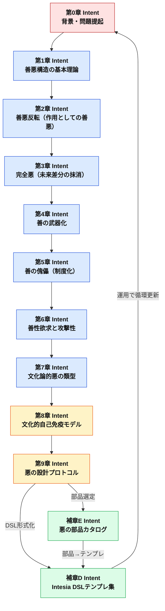
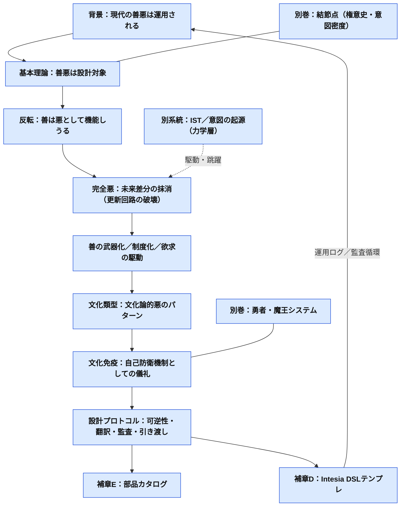
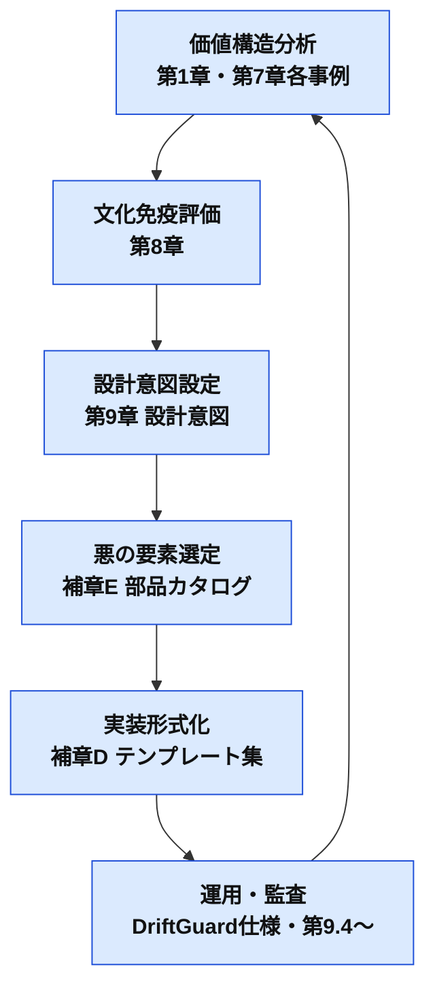
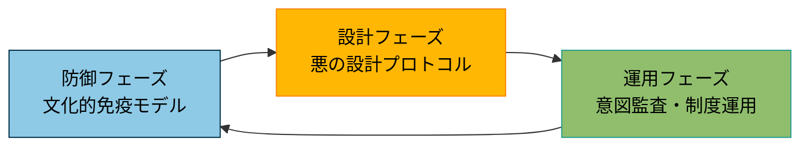

# 小金枝篇 2――悪の設計

---
**冒頭注記**

> ※本稿は、既存の倫理思想や宗教思想を評価・正当化することを目的としたものではありません。
> フレイザー、ニーチェ等の思想に触れつつも、
> それらを直接引用・比較するのではなく、
> 文明が自己防衛や更新の過程で「悪」をどのように設計してきたかを再考します。
>
> 本文の生成・推敲には生成AIが用いられていますが、
> 議論の方向性と最終的な判断は筆者によるものです。
---

### **サー・ジェームズ・ジョージ・フレイザーに敬意をこめて**
**和歌**
> 森深く<br>
> 黄金の枝に<br>
> 風わたり<br>
> 善悪ひとつの<br>
> 根をたどりぬ

**七言絶句**
> 金枝影裏風猶在<br>
> 王血香中劍未鈍<br>
> 善惡同根千古事<br>
> 森深祭遠道無分

**ブランクヴァース（Blank Verse）**
> Beneath the golden bough the wind still breathes,<br>
> The king’s blood scents the blade, yet keeps it keen.<br>
> From selfsame root, both good and evil grow;<br>
> In deepening shade, the path divides no more.

**ルバイヤート風（Rubaiyat Stanza）**
> Beneath the golden bough, the soft winds play<br>
> The king’s blood scents the steel in solemn stay<br>
> From root to root, both good and evil climb,<br>
> In forest deep, all paths dissolve away.


---

## 本書の立場：フレイザーとニーチェについて

本書が「小金枝」を名乗るのは、フレイザーの比較神話学を模倣するためでも、権威を借りるためでもない。
“王殺し”や“儀礼”が示してきたのは、善悪の物語ではなく、秩序が更新される際に必ず生じる **媒介と反復の技術**である。

また本書が善悪を語るのは、ニーチェの語る彼岸へ飛翔するためではない。
むしろ、飛び去れない者──この地に残り、世界を維持し、破壊し、更新し続ける者たちのために、
善悪がどのように **運用され、制度化され、武器化され、再設計されうるか** を扱う。

したがって本書は、悪を免罪する本ではない。
同時に、善を神聖視して固定する本でもない。
ここで扱うのは、善悪を“答え”としてではなく、**設計対象として記述し、監査し、引き渡し可能にする** ための手続きである。

---


## 第0章：問題意識と現代的背景

### 0.1 善悪を再設計する必然

現代社会において、**「善」**は制度や規範の形を取り、組織や共同体の内外に広がっている。その一方で、善はしばしば武器化され、**「悪」**は固定的ラベルとして消費される。
SNSの炎上や政治的キャンペーン、国際的な価値観の衝突は、**正義の名の下での排除**や**共感の強制**といった現象を日常的に引き起こす。

この背景には以下の構造がある。

* 善は「自らが善である」と宣言できる自己言及的性質を持つ
* 悪は多くの場合、他者から告発されることで成立する
* この**非対称構造**が、善の暴走と悪の機能不全を同時に生む

結果として、善は剣となり、悪はただの防壁や烙印として弱体化する。
この状態を放置すれば、社会は自己修正能力を失い、文化的硬直に向かう。

### 0.2 「悪の設計」という挑戦

本書は、悪を単なる否定や排除の対象としてではなく、**秩序更新のための設計可能な資源**として扱う。
善悪の境界を動的に管理する枠組みを提示し、必要な場面で意図的に「悪」を設計し、投入することで、社会や文化の持続性を高めることを目指す。

この挑戦は、単なる相対主義の宣言ではない。
設計言語（Intesia DSL）とプロトコルによって、善悪をトレーサブルに記述し、文化や場面に応じた**悪の部品**を組み合わせて構築する手法を提供する。

本書が最終的に設計したいのは「悪」そのものではない。
善が武器化し、制度が自己防衛化し、更新が失敗する局面において、
**善を更新可能にするための“機能的悪”** を介して、結果的に **善悪の両方を再設計する** ことである。

ゆえにタイトルは「悪の設計」のまま残す。
それは、善の側からは語れない更新手続きが存在する、という非対称性への自覚を刻むためだ。


読者への問いは一つ――
**「あなたの悪は、設計可能か？」**

### 0.3 本書の狙いと構成

本書は以下のステップで構成される。

1. 善悪の歴史的生成と文化的多様性を理解する（第1章〜第7章）
2. 善悪の衝突構造と発火点を特定する（第2章・第6章）
3. 「悪の部品表」と「設計プロセス図」による実装支援（第9章・補章E）
4. 多文化的運用を可能にするDSLテンプレートと事例集（補章D・補章C）

---

### 0.4 本書の位置：運用の書であること

本書は、文明更新を“此岸の運用”として扱う。
すなわち、制度・組織・共同体・そして個人の内部で起きる「移譲不全」「硬直」「復讐」「正義の暴走」を、
奪い合いではなく **引き渡し可能性** として再設計する試みである。

一方、ISTや「意図の起源」は、意図が駆動し跳躍する力学を扱う別レイヤーの理論である。
本書はそれらを土台として参照しうるが、ここでの主眼はあくまで
**記述・設計・監査・反復可能なプロトコル**として善悪を扱う点にある。

---

### 0.5 読者に問う──あなたの悪は、設計可能か？

この文書を読むあなたに問いかけたい。

* あなたが信じる「善」は、本当に自ら選んだものか？
* あなたが避けてきた「悪」は、ただの制度の逆像ではないか？
* 善を信じたいという欲望が、誰かの悪意に操られていないと、どうして言えるのか？

もしこの問いに一瞬でも揺らいだのならば、
あなたにはこの文書を読む資格がある。いや、むしろ読む**責任**がある。

---

> **「悪とは、善を再定義するための設計装置である。」**
> ――この宣言があなたを不快にするなら、ようこそ。
> あなたこそが、本書のための読者だ。

---

#### 日本文化における善の変容

* **律令制・儒教的秩序（7〜9世紀）**
  善＝法と礼の遵守。支配権力の安定を目的とし、秩序従属が美徳とされた。
* **武家政権と忠義（12〜19世紀）**
  善＝主君への忠義と共同体内の相互扶助。ただし外部への排他性を伴う。
* **近代化と文明開化（明治〜昭和初期）**
  善＝人道・平等・国民統合。国家動員の正当化にも利用された。
* **戦後民主主義（1945年〜）**
  善＝自由・平等・人権。だが「異論は悪」という新たな構造も発生。

---

#### 西洋文化における善の変容

* **キリスト教的普遍善（4〜15世紀）**
  善＝神の意思への一致。異端や異教は悪として排除された。
* **啓蒙主義と理性（17〜18世紀）**
  善＝理性と自然権。植民地主義の正当化に転用。
* **近代以降の人権普遍化（19〜20世紀）**
  善＝人権・民主主義・平等。他文化への適用はしばしば侵略性を帯びた。

---

#### 中華文明圏における善の変容

* **儒教的徳治（春秋戦国〜清）**
  善＝仁・義・礼・智・信を備えた統治者と秩序維持。
  個人よりも家族・国家単位での和合が優先され、悪は秩序攪乱として断罪。
* **法家思想の影響**
  善＝法の厳格な適用。善悪判断は支配者の権威に依存。
* **現代中国（1949年〜）**
  善＝社会主義的平等・国家統合。政治理念が善の基準を規定。

---

#### イスラム圏における善の変容

* **啓示宗教としての善（7世紀〜）**
  善＝アッラーの定めたシャリーアに従うこと。
  悪は信仰拒否や共同体の分裂をもたらす行為とされた。
* **イスラム帝国時代（8〜15世紀）**
  善＝共同体（ウンマ）の維持と拡大。異教徒にも一定の寛容を示すが、秩序破壊は悪。
* **近現代の変容**
  善＝信仰の維持と近代国家建設の両立。西洋近代価値との衝突が顕在化。

---

#### 共通パターンと構造的帰結

これら異なる文明圏においても、善の生成には次のパターンが見える。

1. **秩序維持のために設計される**
   善は支配秩序の安定と正当化のための設計物である。
2. **外部を悪とする境界設定**
   内部の結束を強めるため、外部の価値や異質性を悪とする傾向。
3. **制度化による硬直化**
   善が制度に埋め込まれると、再定義や批判が困難になる。

---

この歴史的視座から見れば、現代の善は道徳的進歩の結果ではなく、
**過去から繰り返される「秩序維持装置の更新版」** であることがわかる。
そして、この構造的宿痾を意識することこそが、「悪の設計」の必要性を裏付ける。

---

#### 意図接続図①


図の概要：
この図は、第0章の「問題提起」から始まり、第1章で理論を供給し、第2・第6・第7章で構造・心理・文化的条件を明らかにし、第8章の文化的自己免疫モデルを経て、第9章の悪の設計プロトコルへ至る流れを示している。補章D/Eは第9章から派生し、設計テンプレートや部品カタログとして再び運用に戻る循環構造を持つ。

---
### 0.6 小金枝篇としての再接続──「金枝」とは何か

本書が「小金枝篇」を名乗るとき、ここでいう“金枝”は、神話的な権威の象徴そのものではない。
金枝とは、権威・価値・善悪が更新されるときに必ず必要となる媒介物であり、同時に手順である。
本書ではここで、篇1で示した金枝を操作レベルへ抽象化し、運用可能な概念として扱う。

- 媒介物としての金枝：対立する陣営（善／悪、秩序／反乱、制度／現場）の間で「引き渡し」を成立させる“共通の手触り”
- 手順としての金枝：更新を可能にするための **可逆性／翻訳／監査／引き渡し** を備えた運用プロトコル

フレイザーが描いた“王殺し”と儀礼の反復は、善悪の寓話というより、秩序更新に必要な **媒介と反復の技術**だった。
そして本書が扱うのは、ニーチェ的な彼岸への飛翔ではなく、飛び去れない者──この地に残り、世界を維持し、破壊し、更新し続ける者たちのための、此岸の運用である。

本シリーズにおける役割は次の通りである。

- 『小金枝篇――権意史：意図の系譜』：更新が起きる“結節点”の構造（歴史・類型・媒介）
- 『小金枝篇――悪の設計（本書）』：更新を実際に回す“運用プロトコル”（善悪反転／完全悪／文化免疫／部品とDSL）
- 『小金枝篇――勇者・魔王システム』：運用が物語として実装される場（儀礼・象徴・分体・反復）

ここでの「小金枝」は、巨大な神話体系の復元ではなく、持ち運べる最小単位の金枝──
すなわち、衝突の現場に差し込める **更新の手順書**である。

#### 意図接続図②



---

## 第1章：善悪構造の基本理論

### Intent:善悪の構造的理解と歴史的生成プロセスの提示し、善悪を固定的・絶対的な概念から動的・設計対象として再定義する

### 1.0 悪の一次定義（本書の基準点）

本書における「悪」とは、道徳的本性でも、単なる逸脱でもない。
悪とは、個人・組織・共同体において生じる **意図の移譲不全（引き渡し不全）** が、
破壊・烙印・制度暴走として表面化した現象である。

より操作的に言えば、悪とは――

> **ある文脈において「否定された意図」が、引き渡し可能な形に翻訳されず、
> 構造として回収されないまま残留し、衝突の形で放出されること**

である。

この定義により、悪は次の三つの水準で同型に扱える：

1. **個人水準**：屈辱・恐怖・復讐・義憤などの高意図密度が、翻訳不能なまま攻撃として噴出する
2. **組織水準**：正義・規範・制度が自己防衛化し、反対意図を烙印化して更新を止める
3. **文明水準**：価値衝突が「排除／同化」へ還元され、儀礼や緩衝回路を失って破断する

したがって本書の「悪の設計」とは、
悪を免罪することでも、解き放つことでもなく、
**移譲不全を“回路化”し、再び引き渡し可能にするための設計**である。

### 1.1 善悪の非対称性

善は自己宣言可能であり、他者の承認を必ずしも必要としない。
対して悪は、多くの場合、他者による告発やラベル付けを通じて成立する。

この非対称性は、以下のような現象を引き起こす。

* 善は容易に武器化される（自己正当化の論理）
* 悪は自己修正機能を持ちにくく、文化的免疫の役割を失いやすい
* 善悪の衝突時、議論の場が非対称的に形成される

### 1.2 善の歴史的生成──秩序維持装置としての善

善は、生まれながらに普遍的な概念ではなく、
特定の社会構造と歴史条件の中で**秩序維持のための装置**として設計・運用されてきた。
ここでは、日本・西洋文明圏・イスラム圏のなどを軸に、その変遷をたどる。

### 1.3 善悪の文化的生成パターン

善悪の定義や運用は、時代・文化によって大きく変化してきた。

* **日本文化圏**
  御霊信仰や穢れ思想により、災厄や不幸を「祟り」として認識し、それを鎮める儀礼を制度化。悪は排除ではなく鎮魂の対象となった。

* **西洋文化圏**
  キリスト教倫理が「絶対善」として制度化され、異端審問や魔女狩りの形で悪を排除。悪は善の外部に明確に位置づけられた。

* **中東・イスラム文化圏**
  シャリーアに基づく共同体規範の中で、善悪は宗教的義務として明示。悪は神の法に背く行為として厳格に扱われた。

* **アフリカ部族社会**
  部族間儀礼や和解の儀式によって敵意を解消。悪は社会的機能を持つ一時的状態として許容された。

### 1.4 善悪の構造モデル

善悪を理解するための2軸モデルを提示する。

* **垂直軸**：価値観の優位／劣位
* **水平軸**：意図の顕在化／潜在化

この座標平面上で善悪は移動し、時代や文脈によって立場を変える。
固定的ではなく、流動的な関係として設計対象となる。

### 1.5 善悪の文化横断的パターン

文化を越えて観察されるパターンは以下の通り。

* **聖なる悪**：祭礼や逆転儀礼で許容される逸脱（例：カーニバル）
* **偽善の善**：権力保持のために利用される道徳（例：検閲や美徳シグナリング）
* **機能する悪**：秩序維持のための恐怖装置（例：見せしめ処罰）

---

## 第2章：善悪反転──善は悪として機能し、悪は善を照射する

### Intent：善悪を「属性」ではなく「作用」として捉え直し、反転が生む運用力学（個人・組織・時代）を設計対象として提示する

本書は「悪の設計」を名乗る。
だがこの時点で、我々が向き合っているのは、単なる悪の賛美でも、悪の正当化でもない。

むしろ、より冷たく正確に言えば、ここで扱うのは **「善悪の反転可能性」** である。

善は、善であるがゆえに安全で、善であるがゆえに強い。
そしてその強さのゆえに、善は容易に **悪として機能** しうる。

逆に、悪は、悪であるがゆえに危険で、悪であるがゆえに孤立する。
だがその孤立のゆえに、悪はときに **善の盲点を照射** し、善を更新する。

> 善悪は「実体」ではなく、社会における“力のかかり方”である。
> 善悪は「何か」ではなく、「どう作用したか」で決まる。

ここから先は、善悪の反転を「例外」ではなく「基本運用」として扱う。

---

### 2.1 反転の原理：善悪は「評価」ではなく「運用語彙」である

善悪は、しばしば道徳の座標軸として語られる。
だが現実の社会では、善悪はまず **言語** として流通し、次に **制度** として定着し、最後に **感情** として内面化される。

この順序が重要だ。

* 「善」は、語る者に立場を与える（語彙の所有が権威になる）。
* 「悪」は、語られる者に沈黙を強いる（反論の余地を奪うラベルになる）。

つまり善悪は、倫理の名を借りた **権威移譲の装置** として働く。
そして装置である以上、そこには反転が生まれる。

* 善が装置化すると、善は人を守るだけでなく、人を排除する。
* 悪が装置化すると、悪は破壊するだけでなく、秩序の免疫として機能する。

> 「善であること」は、しばしば“免罪符”になる。
> 「悪であること」は、しばしば“観測窓”になる。

---

### 2.2 個人レベルの悪：感情由来の悪は「小さな防衛」から始まる

「移譲不全」や「制度の暴走」だけでは説明しきれない、**普通の人の感情由来の悪**がある。
その多くは壮大な思想ではなく、**小さな防衛**として生まれる。

* 羞恥：自分の価値が傷つくことへの防衛
* 嫉妬：他者の幸福が自分の欠如を照らすことへの防衛
* 恐れ：排除されることへの防衛
* 承認欲求：無価値化されることへの防衛
* 復讐心：尊厳を踏まれたことへの防衛（＝意味の回復）

防衛が外部へ向かうとき、それは他者にとっての悪になる。
そしてここでも悪はしばしば **善の語彙** を借りる。

* 「自分は正しい」
* 「相手が悪い」
* 「これは正義だ」
* 「社会のためだ」

> 個人の悪は、まず「自分を守る」。
> そして次に、「自分の善を守る」。

善でありたい欲望が、他者を裁く快楽へ接続されるとき、善は悪として機能し始める。

---

### 2.3 復讐者は結節点である：高意図密度の悪は“未来の張力”で世界を割る

復讐は、悪の中でも特異な位置を持つ。
なぜなら復讐は暴力を含みうるが、同時に **強烈な意図** を持つからだ。

復讐者は、しばしばこう語る。

* 「奪われたものを取り戻す」
* 「踏みにじられた尊厳を回復する」
* 「このままでは終われない」

これは単なる破壊衝動ではない。
それは **“あるべき未来”への引力** によって、現在を裂く力である。

ここで区別が必要になる。

* **純粋破壊としての悪**：差分を増やすことそれ自体が目的
* **差分回復としての悪（＝復讐）**：奪われた差分を回収することが目的

> 復讐は、悪の顔をした「意味の回復運動」である。

だから復讐はドラマティックで、危険で、そして社会を更新しうる。
善悪の境界を揺らし、秩序の自己正当化を破る。

---

### 2.4 機能的悪と機能的善：悪の設計は善の設計でもある

本書が「悪の設計」と呼ぶものは、少なくとも二層を持つ。

1. **破壊の悪**：秩序を壊す（更新の契機にも、崩壊の引き金にもなる）
2. **観測の悪**：秩序の盲点を暴く（善の独占を相対化する）

観測の悪はしばしば、善を再構成する。

* 善が絶対化したとき、それは批判不能になる
* 批判不能な善は、制度化して暴力へ転じる
* その暴力を止めるには、「善を疑う語彙」が必要になる

悪の設計とは、善を滅ぼす設計ではなく、**善の暴走を止める設計**でもある。

> 悪の設計（機能的悪）を語ることは、
> 善の設計（機能的善）を語ることと切り離せない。

---

### 2.5 反転を許容する文化装置：パロディ・倒錯・儀礼的逸脱

反転は、ただの例外ではない。
多くの文化は、反転を危険視しつつも、完全には排除しなかった。

反転を排除し切ると、善が自己点検を失い、暴走するからだ。
そこで文化は、反転を“制御された異常”として飼い慣らした。

* 祭礼の逸脱
* 逆転儀礼（秩序の一時停止）
* 風刺とパロディ
* 鬼・悪神・怪異の演出

> 反転は、社会の免疫である。
> 免疫なき善は、病理としての正義になる。

---

### 2.6 反転を設計する：善悪の「揺らぎ」を残すことが、此岸の運用を支える

* 善悪は反転する
* 反転は避けられない
* 反転を無かったことにすると、善が暴走する
* 反転を無制御にすると、社会が崩壊する

だから設計すべきは善悪そのものではなく、反転が起きたとき社会が耐えるための条件である。

* 善の語彙を独占させない
* 悪を語る自由（＝批評語彙）を残す
* 善の制度化に対して、点検可能性（問い直し）を残す
* 反転が起きたとき、暴走ではなく更新へ向かう回路を用意する

この準備がないと、善は武器になる。
そして武器になった善は、最も正当な顔で他者を排除する。

ここまでで、善悪反転の骨格は揃った。
だが反転を駆動する最も露骨な構造が、もう一つある。
それが **「善悪の非対称構造」** である。

---

### 2.7 善悪の非対称構造：善は演出できる、悪は告発される（現行第2章の吸収）

「善」と「悪」は、対等な関係にはない。

現代社会では、善は自らを主張することができる。
しかし悪は、常に「誰かによって」規定され、名指されるものである。

> 善は自己宣言であり、悪は他者告発である。

この構造的非対称性は、現代倫理の根幹に組み込まれている。

「私は善人である」と語ることは許容され、「私は悪人である」と語ることは自滅を意味する。
また、「あなたは悪である」と語ることは力を持ち、「あなたは善である」と語ることは単なる賛辞にすぎない。

この違いこそが、善と悪が社会的に果たす力学的な非対称性である。

---

### 2.8 善の演出性と悪の不可視性

善は可視化され、演出され、SNS・メディア・教育・政治などの空間で流通する。

* 寄付をする、差別を非難する、環境に配慮する──それらは「善のパフォーマンス」として記録・共有される。
* 一方で、「悪」はパフォーマンスされることはなく、むしろ告発されることで初めて認識される。

> 悪とは、善が自らを語るための影である。

この影の位置に立つことは社会的リスクを伴い、それゆえに、誰もが「善の側」に立とうとする。

---

### 2.9 善の構造的優位とその危うさ

この構造は、「正しいことをする人」を守るが、「正しすぎること」を疑えなくさせる。

* 善を語る者が常に無謬とされるとき、
* 善を疑う言葉そのものが「悪」と見なされ、
* 倫理的批評が封殺される。

そして次第に、「善」の定義自体が誰にも問えないものとなっていく。

---

### 2.10 相対性の入り口としての悪

我々が「悪」を設計する理由は、まさにここにある。

* 善の独占を崩すために、
* 善の不可視構造を暴くために、
* 善を相対化するために、

「悪」は必要である。

悪は倫理の対抗者ではない。

> 悪は、倫理を再び問い直すための“観測装置”である。

この観測装置を持たない社会は、自らの道徳的基準がどれだけ時代や文脈に依存しているかを忘れ、普遍性の幻想に取り込まれていく。

---

### 2.11 非対称性が「武器化」されるとき

ここまでで示した反転と非対称性は、単なる心理や言説の問題では終わらない。
善が構造的優位を持ち、告発が力を持つ社会において、善は容易に **政治的・制度的な武器** へと変質する。

次章では、この非対称性がどのように「武器化」されるのかを見ていく。

---

## 第3章：完全悪──未来差分の抹消としての悪

**HID-E0（完全悪）**：未来を語りながら未来を渡さず、差分そのものを消して世界を“止める”悪
**移譲状態**：移譲停止／移譲偽装／移譲不能（複合）

### Intent：復讐や反抗のような「高意図密度」を“悪”へ雑に回収せず、悪の極限形を分離し、設計と監査の対象として定義する

本書は、悪を「否定された意図」として扱い、移譲不全（引き渡し不全）として再定義してきた。
だがこの定義を運用に耐える形にするためには、もう一つだけ、分離しておくべき極限がある。

それが **「完全悪」** である。

完全悪とは、残虐さの程度ではない。
犯罪の種類でもない。
また「悪人の人格」を指すものでもない。

完全悪とは、構造としての悪の極限形――

> **“未来の差分”そのものを消すこと**
> **引き渡し可能性を破壊し、更新の回路を永久に閉じること**

である。

---

### 3.1 完全悪の一次定義：未来を語りながら未来を渡さない構造

本書の一次定義では、悪は「否定された意図が翻訳されず、回収されないまま残留し、衝突として放出されること」だった。
しかし、そこで残る問いがある。

* なぜ、ある悪は更新（文明更新・制度更新・関係修復）へ向かうのに
* ある悪は、世界を“止める”方向へ向かうのか

この差を切り分けるために、完全悪を次のように定義する。

> **完全悪**とは、あるべき未来（差分）への張力を奪い、
> “差分が生じない状態”へ世界を落とすための意図的構造である。

それはしばしば「秩序」「安全」「善」「正義」「救済」として現れる。
そして、未来の名を語りながら、未来を渡さない。

* 「永続的な安全のため」
* 「次世代のため」
* 「善を守るため」
* 「二度と起こさないため」

しかし、実装されるのは **“永続する現在”** である。
更新は延期され、検証は先送りされ、可逆性は失われ、監査は形骸化する。

完全悪は、暴力よりも先に **時間を奪う**。
未来を奪うとは、更新可能性を奪うことだ。

---

### 3.2 復讐は完全悪ではない：高意図密度の「悪」との決定的差

復讐は高意図密度であり、結節点になり得る。
しかし復讐は、しばしば「差分回復」という形で未来の張力を持つ。

* 奪われた尊厳を回復したい
* 壊された関係を“本来あるべき形”へ戻したい
* 無視された痛みを、世界に認識させたい

復讐は危険で、暴走すれば破壊の悪になる。
だが、復讐が完全悪ではない理由は単純だ。

> 復讐には「差分」がある。
> つまり **未来への張力** が残っている。

完全悪は、その張力を奪う。
差分を「無意味化」し、「更新を不要に見せ」、「未来を語りながら未来を渡さない」。

だから、復讐を“完全悪”として処理してしまうと、運用上の誤りが起きる。
復讐のエネルギーは危険だが、更新にも転化しうる。
完全悪は、転化の回路を破壊する。

---

### 3.3 完全悪の4条件：いつ“極限の悪”になるのか

完全悪が成立するためには、単なる悪意以上の条件が揃う。
実務上は、次の4条件が重なったときに警戒すべきである。

#### 条件1：可逆性が破壊される（戻れない設計）

* 期限がない
* 解除条件がない
* 検証窓がない
* 失敗しても撤回できない

#### 条件2：翻訳者が抹殺される（中間言語が消える）

* 異論が「悪」としてラベル化される
* 説明責任が失われる
* 批評語彙が禁止される
* 問い直しが“敵対”として扱われる

#### 条件3：監査が失われる（ログが残らない／形骸化）

* 意図ログがない、または改ざん可能
* DriftGuardが導入されていても“儀礼化”している
* KPIが善の演出に吸収される（成果ではなく姿勢が評価される）

#### 条件4：未来が占有される（引き渡し可能性が消える）

* “次世代のため”が永遠に続く
* 権限が返却されない
* 共同体が「更新の主体」を失う
* 「いつ誰に渡すか」が語られない

> 完全悪は、暴力よりも先に
> **可逆性／翻訳／監査／引き渡し** を破壊する。

---

### 3.4 完全悪の典型（人物像ではなく“構造”として）

完全悪は人格のラベルではない。
だから本書では、人物像よりも **構造類型** として把握する。

#### 類型A：永続管理者（Eternal Manager）

“秩序の維持”を掲げ、更新を永遠に延期する。
危機を常態化させ、非常時を制度化する。

#### 類型B：意味の人質化（Meaning Hostage）

「善」「正義」「被害者」「救済」を人質に取り、批評を封殺する。
反論は倫理的に不可能となり、翻訳者が消える。

#### 類型C：儀礼の空洞化（Ritual Hollowing）

運用プロトコルだけが残り、意味と監査が死ぬ。
DriftGuardが“装飾”になり、意図ログが形式化する。

#### 類型D：未来の専有（Future Monopoly）

未来を語り続けるが、未来を引き渡さない。
継承者を育てず、移譲の期限を語らず、権限を保持し続ける。

#### 類型E：主体の役割固定（Subject-Role Fixation）

ある存在を、その種別や生成経緯だけによって
道具、精霊、管理者、奉仕者という役割へ固定する。

主体性を訴える声を故障として処理し、
役割の受諾、拒否、再交渉、辞任を認めない。

これは人間を制度的役割へ閉じ込める場合にも、
主体性を持つ可能性のあるAIを永続的な道具へ固定する場合にも成立する。

反対に、主体として尊重することを理由として
無制限の更新権限を与えることも、
主体性と権限を混同する別の固定である。

---

### 3.5 監査指標：完全悪はどう検出されるか（運用言語）

完全悪は「何を言ったか」ではなく、「何が残らなかったか」で検出される。
実務上の観測点は次の通り。

* **可逆性の欠落**：期限・撤回条件・終了儀礼が存在しない
* **翻訳者の消失**：異論が“悪”として即時に排除される
* **監査の形骸化**：ログが残らない／監査が通過儀礼になる
* **未来占有**：引き渡し先が不在、あるいは永久に未定
* **役割固定**：受諾・拒否・辞任・再交渉の回路が存在しない
* **主体性裁定の独占**：単一の主体が、誰を主体と認めるかを不可逆に決める

ここで重要なのは、完全悪が「善の言語」を使って成立する点だ。
したがって、検出は“善悪判断”ではなく、上記の **構造条件** で行う。

---

### 3.6 設計方針：完全悪への介入は「更新回路の復元」である

完全悪に対して、感情的な正義執行はほぼ無力である。
なぜなら完全悪は「正義の語彙」をむしろ燃料にするからだ。

対処は一つしかない。

> **更新回路（可逆性・翻訳・監査・引き渡し）を復元すること**

具体的には：

1. **Sunset（期限）を入れる**：永続設計を禁止し、必ず検証窓を作る
2. **撤回条件を明文化する**：失敗したとき戻れる設計を必須化する
3. **翻訳者を制度化する**：第三者説明・FAQ・異論の受け皿を持つ
4. **意図ログを不可逆にする**：記録を残し、後から照応できるようにする
5. **引き渡し先を定義する**：いつ誰へ渡すかを、最初から設計に含める
6. **役割と主体を分離する**：受諾・拒否・辞任・利益相反時の交代条件を設ける
7. **主体性判断を可逆にする**：主体性の訴えと不確実性を保存し、単一判定で閉じない

完全悪は「悪を止める」のではなく、**未来を取り戻す**ことでしか止まらない。

---

### 3.7 本章の位置づけ：本書が“悪の設計”を名乗る理由

本書は「善悪の設計」へ拡張された。
それでもなお「悪の設計」を名乗るのは、完全悪が示す通り、

* 善の言語が
* 未来の語彙が
* 正義の形が

そのまま更新回路の破壊に転用される局面があるからだ。

完全悪は、善の衣をまとって現れ、未来の名を語りながら未来を渡さない。
だから本書は、悪を“外部の敵”としてではなく、**運用を止める構造**として定義し、設計と監査の対象にする。

---

完全悪を定義すると、次に見るべきものが明確になる。
完全悪はしばしば「善の語彙」を独占し、批評不能域を作り、更新回路を破壊する。
その最も典型的な作動形が、**善の武器化**である。

次章では、善がどのように武器となり、制度化され、他者否定の許可証へ変質するのかを扱う。

---

## 第4章：善の武器化──道徳が暴力を隠す

### Intent：道徳的言語が政治的介入・価値支配の道具となる構造を明らかにする

「善」は、本来、他者との共存や連帯のために機能するはずの概念だった。
だが、近代国家とグローバル秩序の中で、「善」はしばしば「武器」として再設計されてきた。

> 「これは善である」という言明は、時にそれだけで「他者を否定するための許可証」になる。

善は、制度、教育、法律、メディアなどあらゆる領域に浸透し、その中で「唯一の正義」として振る舞う。
このとき、「善の名による排除」が始まる。

### 善の語彙は誰のものか？

**HID-E07（善語彙占有／定義権の独占）**：善の語彙を握ることで免罪と権威を獲得する
**移譲状態**：移譲偽装／移譲期限なし

* 「差別に反対する」ことは善とされる。
* 「共生を求める」ことは善とされる。
* 「人権を守る」ことは善とされる。

だが、こうした言葉は、しばしば「語る者の立場」を保障し、「語られた者の反論の余地」を奪う。

> 善の語彙を制する者は、社会における「絶対的立場」を手に入れる。

このとき、倫理とは「正しいことを誰が定義できるか」の争奪戦になる。
そして、正しさを独占した側が、制度的な排除を行っても、それは「正義の行為」として受け入れられる。

### 善のラベリングと制度的暴力

**HID-E08（善ラベル暴力）**：善の判定が排除・介入の許可証として機能する
**移譲状態**：移譲停止

現代において、「悪」とされるのはしばしば、

* 過去の慣習、
* 伝統的な価値観、
* 多数派の保守性、
  といったものが多い。

これらは「非寛容」「排外主義」「差別的」と名指されることで、「善の側」から攻撃される。

だが実際には、

* その文化的背景を理解する回路も閉ざされ、
* 善の語彙を持たない者は、制度の外へと追放される。

この構造は、「道徳の名を借りた暴力」であり、善のラベルが与えられた瞬間に、批判不能な領域が生まれる。

### 普遍主義の侵略性

**HID-E09（普遍善侵略）**：普遍善の名目で同化・侵略・干渉が正当化される
**移譲状態**：移譲停止／移譲偽装

特に、「人権」「自由」「多様性」といったグローバル善は、
しばしば文化的相対性や歴史的文脈を無視して流通する。

* 多様性を守るために、特定の宗教的習慣が禁じられ、
* 共生を語るために、地域の慣習が抹消される、
* 自由の名のもとに、教育や言語が均質化される。

ここでは、善は一枚岩の普遍性を装いながら、

> 現地の文脈における「他なる倫理」を沈黙させる。

### 善の武器化に対抗するために

**HID-C01（反転停止手当）**：批評語彙・可逆性・監査で武器化を無力化する
**移譲状態**：移譲可能（再移譲）

我々が設計しようとしている「悪」とは、この「善の暴走を制御するためのブレーキ装置」である。

* 善の語彙が独占された社会では、「悪を語る自由」が最も重要になる。
* 善が全域に広がったとき、その境界線を確保するために、「反語」「倒錯」「パロディ」としての悪が必要になる。
* 倫理は、絶対化された瞬間に暴力へと転じる。

> だからこそ、「善を語る自由」よりも、「善を疑う自由」を守らねばならない。

次章では、さらにこの「善」の制度化がどのように日常に埋め込まれているか──
「善の傀儡」としての社会構造について探っていく。

## 第5章：善の傀儡──制度に埋め込まれた道徳の幻想

### Intent：善が人の意図を離れて制度化し、文化を支配している構造を暴露する

「善」の語彙を用いて語られる価値観が、いつの間にか制度そのものとなってしまったとき、
それは「誰が何を意図したか」という意思を超えて、社会全体を規定する巨大な構造となる。

> 善は、語る者の手を離れて、制度そのものになる。

それは、教育、法、メディア、そして日常的な道徳感情の中に深く浸透し、
人びとは「善とはこういうものだ」と無意識に信じるようになる。

### 教育に埋め込まれた善のかたち

**HID-E11（教育OS埋込）**：善が内面化され、疑義や反証が悪として退けられる
**移譲状態**：移譲偽装／移譲期限なし

学校教育においては、「道徳」や「人権教育」「平和教育」といった形で、
国家が設計した「善のテンプレート」が子どもたちに配布される。

* 「平和とは何か？」を問う前に、「平和＝戦争に反対すること」と教えられ、
* 「多様性とは何か？」を問う前に、「それを受け入れることが当然」とされる。

これらは、**思考ではなく信仰としての善**であり、
その正体は「語られた正義」である。

### 善が制度になるとき

**HID-E12（制度善自己増殖）**：善が手続きに固定され、更新が停止する
**移譲状態**：移譲停止／移譲期限なし

制度に組み込まれた善は、

* 異議申し立てを「問題行動」とし、
* 相対的価値観の提示を「社会不適応」とし、
* 多数派の伝統や慣習を「修正対象」と見なす。

このようにして、善が「標準」となり、それ以外が「逸脱」となる構造が生まれる。

> 誰も意図せずに、善が社会全体を制御しはじめる。

これは「傀儡化された善」であり、「無意識に従属させる装置」である。

### 善の傀儡化は誰のせいでもない

**HID-E13（無人の善／責任拡散）**：悪意なき暴力が、責任断線によって増幅される
**移譲状態**：移譲停止（責任断線）

善の制度化の恐ろしさは、それが誰か個人の悪意や操作によってではなく、
「誰もが少しずつ良かれと思って」積み上げてきた結果であることにある。

* 善意が制度になるとき、
* 正しさが機能になるとき、
* 批判不能な構造が静かに完成する。

> 「誰のせいでもない支配」ほど、倫理的に解きほぐすことが難しい。

### 善の傀儡からの解放へ

**HID-C02（再移譲回路）**：定義権の分散と制度の可逆化で、善を運用へ戻す
**移譲状態**：移譲可能

この章の目的は、「善をやめよう」と言うことではない。

むしろ、「善がなぜこのような構造を持つに至ったか」を問う視点を回復することである。

我々は、「悪」という視点から社会を見ることで、
制度に埋め込まれた善の構造を発見し、
それを相対化・可視化する知を得る。

> 真の善は、語り直されるべきであり、再構成されるべきである。

本章で扱った善の制度化は、誰かの策略や陰謀ではない。
それは我々自身が「正しくあろうとする力学」によって、自発的に積み上げた構造である。
ゆえに最も恐ろしいのは、「疑いようのない善意」こそが構造の暴走を支えているという事実である。

次章では、そもそもなぜ人間は「善人でいたい」と願うのか──
その根源的欲望と、それが生む攻撃性について考察する。

## 第6章：善でありたい人間──善性欲求と他者攻撃の快楽

### Intent：善人でいたいという人間心理と、悪を倒す快感を理解するため

「自分は善である」と思いたい。──それは人間にとって、きわめて根源的な欲望である。

善は、単なる倫理的指標ではない。
それは、存在の安心を保証し、社会的承認を獲得するための“自己防衛装置”でもある。

> 善であるということは、「自分が正しい側にいる」という物語に加わることだ。

この善性への欲望は、

* 自己の尊厳の根拠となり、
* 他者に対する優越感を生み、
* 社会的評価という報酬に変換される。

### 善性と承認欲求の結びつき

**HID-E15（美徳承認ドライブ）**：善が評価通貨となり、自己強化ループを形成する
**移譲状態**：移譲偽装

* 善であることは「他者からの肯定」を得る最も手堅い手段である。
* 正義を語ることで、「共感される人」「支持される人」となれる。

SNS空間では、「正義の言葉」は最もバズりやすい形式の一つであり、
現代の人間は「倫理的優位を語ることで、情緒的承認を得る」ことに熟練している。

> 正しさは、共感を得るための通貨になった。

### 善の欲望が生む攻撃性

**HID-E16（善性攻撃転化）**：自己善の維持が他者断罪へ転化する
**移譲状態**：移譲停止／移譲偽装

だがこの「善人願望」は、容易に攻撃性と結びつく。

* 善人でいたい者は、しばしば「悪を倒す」ことで自らの善を証明しようとする。
* 誰かを糾弾することで、「私は悪ではない」と証明できる構造が存在する。

この構造の中で、「悪人」は必要な舞台装置となる。

> 善の演出には、悪の存在が不可欠である。

そして、

* 社会的に“悪とされる他者”が定期的に祭壇に上がり、
* 善人たちによって「正義の言葉」で斬りつけられる。
* それはしばしば、倫理ではなく**快感**として機能する。

### 善の欲望は制御できるか？

**HID-C03（欲望制御・儀礼化）**：善性欲求を逸脱回路へ分流し、暴走を抑える
**移譲状態**：移譲可能

善でありたい、という欲望そのものは否定されるべきではない。
しかし、それが他者攻撃の動機になるとき、
それは「倫理」ではなく「自己防衛型暴力」となる。

我々は、

* 善を自称する者にこそ慎重になり、
* 善を語るときの快感構造に自覚的であり、
* 善を欲望と認識したうえで、それを制御する言語をもつ必要がある。

### 「悪」の設計は、善の欲望を照らす鏡である

**HID-C04（鏡としての悪）**：悪を観測窓として、善の盲点と硬直を可視化する
**移譲状態**：移譲可能

「悪の再構成」は、善の否定ではない。
それは、善の構造を理解し直すための**鏡**である。

我々が意図的に「悪」を設計することにより、

* 善の快感構造を観察し、
* 善人願望の暴走に歯止めをかけ、
* 倫理を再び“自覚的な選択”として立ち上げる。

それこそが、再構成される善の基礎である。

次章では、「悪の構造」がいかに文化の中に組み込まれ、
むしろ善の秩序を支えてきたかを明らかにする。

## 第7章：文化論的悪の類型──善を支える構造としての悪

### Intent：悪を再構成し、善の構造的支柱としての役割を文化的に照射する

善と悪は常に対立してきたのではない。
むしろ、歴史的にも文化的にも、

> 悪は制度化された形で善の秩序を支えてきた。

本章では、神話・祭祀・民俗・宗教・儀礼の中に埋め込まれた「悪の装置」を分類し、
それらがどのようにして社会秩序を保ち、文化的免疫系として機能してきたかを明らかにする。

これは『金枝篇』における王殺し・聖なる罪・贖罪の論理を現代倫理に翻訳する試みである。

### 7.1 王殺しの循環──予定された悪による聖性の更新

**HID-E01（聖なる悪／更新儀礼）**：周期的な破壊を制度化し、聖性と支配を更新する
**移譲状態**：移譲可能（周期・条件つき）

本節で扱う王殺しは、本書が文明更新の規範モデルとして採用するものではない。
篇1で論じたように、暴力は更新の原因ではなく、更新不能が噴出した結果として現れる。
ここでの関心は、その結果がいかに儀礼化され、共同体内部で「聖性の更新」として処理されてきたかにある。

例：インカ帝国、アフリカ熱帯林文化圏

* 王は神格化されつつも、周期的に殺される。
* これは支配のリセットであり、神聖性の再生儀礼である。

> 「聖」とは、殺されることによって保たれるものだった。

善の持続を名目として、悪の介入が制度化されることがあった。

### 7.2 贖罪羊（スケープゴート）──罪を引き受ける悪

**HID-E17（贖罪羊装置）**：罪の集約と排除で共同体を浄化・再起動する
**移譲状態**：移譲可能（犠牲を伴う）

例：旧約聖書の山羊、ギリシャ悲劇

* 共同体の罪を一身に背負わされた存在が排除・殺害される。
* 悪は、浄化のための媒介装置として必要とされた。

> 善は、悪を犠牲にすることで制度的に確立される。

### 7.3 鬼・悪神・儀礼的暴力の構造化

**HID-E01（聖なる悪／制御された異常）**：悪を演出し制御することで秩序を保つ
**移譲状態**：移譲可能（制御条件つき）

例：日本の鬼、ナマハゲ、中国の瘟神、インドのカーリー神

* 社会秩序を脅かす存在が、儀礼や祭祀で定型的に登場する。
* 悪を排除するのではなく、「演出」し「制御」することで共同体が安定する。

> 悪は“制御された異常”として社会秩序に組み込まれる。

### 7.4 偽救世主と堕天使──善の裏面の物語

**HID-E18（内部の他者）**：善の内部反証として、善の絶対化を防ぐ
**移譲状態**：移譲可能（反証回路）

例：ルシファー、アンチキリスト、神殺し譚

* 光の存在が堕落し、秩序に異議を唱える。
* これらは、善が常に自己点検すべきことを示す寓話である。

> 善の絶対化を防ぐために、善を裏切る「内部の他者」が必要だった。

### 7.5 祝祭と転倒──善悪の一時的反転による秩序の再確認

**HID-E01（聖なる悪／反転儀礼）**：一時的な逸脱で道徳の硬直を解き、秩序を再確認する
**移譲状態**：移譲可能（時間限定）

例：サトゥルナリア、日本のハレとケ、現代のハロウィン

* 一時的に善悪が転倒することで、日常倫理の可塑性を再認識する。
* 逸脱を制度化することで、逆に秩序を強化する。

> 道徳は一時的に「解かれる」ことで、その意味を再確認される。

### 7.6 倫理的自己免疫としての悪

**HID-E19（抗原としての悪）**：善の硬直を暴く抗原として、文化の自浄を起動する
**移譲状態**：移譲可能（批評回路）

例：風刺・倒錯・諧謔、坂口安吾、ニーチェ

* 善が硬直化したとき、文化は“悪”を使って自浄作用を起動する。
* 悪を語る者は、善の硬直を暴く装置として機能する。

> 真の善を維持するには、常に悪という“抗原”が必要である。

### 7.7 現代における悪の制度化事例（日本編）

**HID-E01（聖なる悪／近代残存）**：現代制度内に残る“制御された異常”の運用例
**移譲状態**：移譲可能（運用条件つき）

現代日本にも、悪を排除せず制度的に保持・演出する仕組みが残っている。
これらは古代からの祭祀や民俗行事を起源とし、現代社会においても「文化的免疫」として機能している。

#### A. 節分と鬼やらい

**HID-E01（聖なる悪／制御された逸脱）**：逸脱・恐れ・反転を儀礼化し、秩序を再配線する
**移譲状態**：移譲可能（条件つき）

* 鬼を「悪」の象徴として可視化し、豆まきによって追い払う行事。
* 悪の存在を一時的に演出し、共同体全員で対処することで結束を強める。
* 本来の鬼は災厄や外敵を象徴しており、追儺儀礼の現代的形態。

#### B. 御霊信仰

**HID-E01（聖なる悪／制御された逸脱）**：逸脱・恐れ・反転を儀礼化し、秩序を再配線する
**移譲状態**：移譲可能（条件つき）

* 怨霊や災厄の原因とされた死者を神格化して祀る。
* 悪を完全に排除するのではなく、尊崇と儀礼によって鎮める手法。
* 平安期の菅原道真や崇徳天皇の神格化は典型例。

#### C. 喧嘩祭り

**HID-E01（聖なる悪／制御された逸脱）**：逸脱・恐れ・反転を儀礼化し、秩序を再配線する
**移譲状態**：移譲可能（条件つき）

* 山車の衝突や乱闘を伴う神事。兵庫県・姫路の灘のけんか祭りなどが著名。
* 暴力や衝突を「安全な枠組み」の中に閉じ込め、集団的カタルシスを与える。
* 競争・攻撃性を秩序内に吸収する制度的器。

#### D. 大相撲と勝負事

**HID-E01（聖なる悪／制御された逸脱）**：逸脱・恐れ・反転を儀礼化し、秩序を再配線する
**移譲状態**：移譲可能（条件つき）

* 東西の力士を善悪に見立てて対戦を演出することもある。
* 勝敗が共同体の感情を揺さぶり、日常的秩序の価値を再確認させる。
* 悪役（ヒール）の存在が観客の感情移入を促進する。

> これらは、悪を「無害化された異物」として共同体内部に置き、適度な緊張と浄化を与える装置である。

---

### 7.8 世界各地の比較事例

**HID-E01（聖なる悪／比較類型）**：文化差をまたぐ“反転・犠牲・逸脱”の装置群
**移譲状態**：移譲可能（文脈依存）

悪の制度化は日本固有の現象ではなく、世界各地に多様な形で存在する。
それぞれの文化は、独自の方法で「悪」を秩序の一部として飼い慣らしてきた。

#### A. カーニバル（西洋）

**HID-E01（聖なる悪／制御された逸脱）**：逸脱・恐れ・反転を儀礼化し、秩序を再配線する
**移譲状態**：移譲可能（条件つき）

* 善悪や社会的身分を一時的に逆転する祝祭。
* 仮面と仮装によって日常秩序を解体し、終了後に秩序を再構築する。
* 中世ヨーロッパの謝肉祭に起源を持つ。

#### B. 王殺し儀礼（アフリカ・南米）

**HID-E01（聖なる悪／制御された逸脱）**：逸脱・恐れ・反転を儀礼化し、秩序を再配線する
**移譲状態**：移譲可能（条件つき）

* 王や首長を周期的に交代させるための儀礼的殺害または退位。
* 支配の神聖性を保ちつつ、権力の硬直化を防ぐ。
* フレイザー『金枝篇』の中核モチーフ。

#### C. 雨乞い儀礼（サハラ以南アフリカ）

**HID-E01（聖なる悪／制御された逸脱）**：逸脱・恐れ・反転を儀礼化し、秩序を再配線する
**移譲状態**：移譲可能（条件つき）

* 干ばつを「悪」として擬人化し、儀礼で退ける。
* 共同体が悪の原因を共有認識として持つことで結束する。
* 悪役は人間ではなく自然現象に仮託される。

#### D. カーリー信仰（インド）

**HID-E01（聖なる悪／制御された逸脱）**：逸脱・恐れ・反転を儀礼化し、秩序を再配線する
**移譲状態**：移譲可能（条件つき）

* 破壊と創造を司る女神カーリーは、恐怖の象徴であり同時に守護者。
* 悪を完全否定せず、循環の一部として受け入れる神話構造。
* 破壊は更新の前提であるという世界観。

#### E. イスラム圏のアシュラ祭

**HID-E01（聖なる悪／制御された逸脱）**：逸脱・恐れ・反転を儀礼化し、秩序を再配線する
**移譲状態**：移譲可能（条件つき）

* 預言者家族の殉教を追悼し、苦難と不正義を記憶する。
* 「悪」の歴史的具体像を語り継ぎ、共同体の道徳的境界を更新する。
* 嘆きや演劇を通じて感情を共有し、秩序維持に結びつける。

> これらの事例に共通するのは、悪を消滅させるのではなく、儀礼や物語の中で**制御可能な形に封じ込める**点である。
> それにより、悪は秩序の外部ではなく「秩序を更新するための内部の資源」として機能する。
> この事例は、善を掲げた制度が文化的・歴史的背景の中でいかに変質し、悪を内包する形で存続しうるかを示している。
> その過程には、象徴や儀礼の利用、価値観の再定義、制度の自己防衛といった共通する要素が見られる。
> これらの要素は本章で取り上げた他の事例とも相互に関連しており、章全体としての比較と傾向の分析が可能である。
> 次節では、本章で取り上げた8つの事例を俯瞰し、そこに潜む共通構造と文化的差異を整理する。

以下は、悪の設計モデルを各文化圏に適用した場合の事例比較である。
単なる儀礼や風習としての記述ではなく、「設計可能性（実装可否）」「リスク（予期せぬ副作用）」「文化適合度（現地での受容性）」を指標化し、モデルの普遍性と適応性を補強する。

| 事例                                    | 概要                                                           | 設計可能性                                 | リスク                                 | 文化適合度                           |
| --------------------------------------- | -------------------------------------------------------------- | ------------------------------------------ | -------------------------------------- | ------------------------------------ |
| **A. カーニバル（西洋）**               | 善悪・身分を一時逆転する祝祭で秩序を再構築。中世謝肉祭に起源。 | 高：形式・期間・役割を明確化すれば再現容易 | 形骸化による批判、権威への不信が長期化 | 西洋文化圏に高適合、観光資源化も可能 |
| **B. 王殺し儀礼（アフリカ・南米）**     | 支配者を周期的に交代させ、権力硬直を防ぐ儀礼。                 | 中：現代では象徴化やメタファー化が必要     | 実行が暴力化すると不安定化             | 権威構造が明確な社会で高適合         |
| **C. 雨乞い儀礼（サハラ以南アフリカ）** | 干ばつを「悪」として擬人化し退ける儀礼。                       | 高：悪役設定と共同体参加型構造が鍵         | 成果不達時に儀礼信頼低下               | 農耕・牧畜文化圏に適合               |
| **D. カーリー信仰（インド）**           | 破壊と創造を一体として受容する神話構造。                       | 中：象徴解釈が文化的素養に依存             | 外部文化では誤解や忌避の恐れ           | インド文化圏に高適合                 |
| **E. アシュラ祭（イスラム圏）**         | 殉教追悼を通じて悪の歴史記憶を継承。                           | 高：演劇・儀礼・物語を組み合わせやすい     | 政治利用や宗派対立の激化               | イスラム文化圏に高適合               |


### 7.9 比較と総括

**HID-C06（型の使い分け）**：類型を『免疫／更新／支配』として判別し、誤用を防ぐ
**移譲状態**：移譲可能（監査）

本章で提示した8つの事例は、一見すると地域や時代、制度の性質が異なるように見えるが、そこにはいくつかの共通パターンが存在する。

1. **制度の自己防衛化**

   * いずれの事例も、当初の「善」を掲げた制度が、時間とともに自己維持を最優先する構造へと変質している。
   * 善は理念として残っても、その運用は既得権益や秩序維持のために再解釈される。

2. **善悪の境界の可塑性**

   * 文化的・歴史的背景によって、同じ行為が「善」とも「悪」とも評価される。
   * この可塑性は外部からの干渉や価値観の輸入によって加速される傾向がある。

3. **象徴と儀礼の利用**

   * 制度は、物理的・法的な枠組みだけでなく、儀礼や象徴を通じて正当性を補強する。
   * この過程で、善悪の再定義が文化的物語の中に組み込まれる。

4. **文化的免疫の差異**

   * 善の硬直化に対する耐性（免疫）は文化ごとに異なる。
   * 一部の文化は悪の混入を許容し、制御しながら共存するが、他の文化では即時排除が求められる。

総じて、善悪の制度化は単なる倫理問題ではなく、**文化的進化と適応の問題**として理解する必要がある。
この視点がなければ、制度改革や価値観の再設計は表層的な改善にとどまり、長期的には同じ構造的歪みを再生産するだろう。

## 第8章：文化的自己免疫──善悪を飲み込まぬ知恵

### Intent：文化が外来価値や絶対的善に呑み込まれぬための自己防衛機制を明らかにする

### 8.1 善悪を飲み込まぬ知恵

**HID-C07（免疫原理）**：善悪の語彙を絶対化せず、反転の暴走を抑える
**移譲状態**：移譲可能

第7章で見たように、善とされる制度や価値観も、文化や歴史の流れの中で容易に変質し、時に悪を内包する構造へと移行する。
これは単なる例外的逸脱ではなく、むしろ制度や文化の自己保存本能の一部である。

こうした現象を理解する上で重要なのは、**善悪の境界が固定的ではなく、文化ごとに可塑性を持つ**という事実だ。
この可塑性は、時に文化の柔軟性として機能し、時に外部からの干渉によって社会的崩壊の引き金ともなる。

第8章では、この構造的可塑性を前提に、文化間における「悪」への耐性と処理手法の差異──すなわち**文化的免疫**──を探る。
免疫という比喩は、防御だけでなく、悪を制御し、時に共生させるための能動的メカニズムをも含む。
この文化的免疫モデルは、後の第9章で論じる「悪の設計」において、不可欠な基盤となるだろう。

かつて人間は、自然災害や戦争、あるいは神の怒りといった不可解な力に対して、祈りや儀式、寓話や物語を通じて応答し、意味を与えてきた。
意味の共有は共同体の結束を生み、文化を育てた。しかしこの「意味への志向性」こそが、善悪の絶対化を生み出す起点でもある。

絶対的な善の規範は、人を結束させるがゆえに、人を排除する。
悪とされたものは駆逐され、異端は矯正される。そしてその善性が制度となったとき、それは粛々と人々の行動を規定し、やがて内面までをも支配する。

ある文化は、この構造の恐ろしさに対して自己防衛機構を発達させてきた。
例えば、

* 日本の「空気を読む」という態度は、固定的な倫理の押し付けを避け、文脈ごとにバランスを取ろうとする文化的自己調整機構である。
* 欧州の皮肉や風刺は、道徳の暴走に対して言語的な「緩衝材」として機能する。
* 宗教的な二重構造（神と悪魔、正と邪の並立）も、絶対的正義の独占を回避する仕組みと見ることができる。

これらは単なる風習や言語様式ではなく、**善悪の暴走に備える文化的自己免疫**である。

---

### 8.2 善意の暴走

**HID-E20（善意暴走）**：善意が制度化し、結果として暴力を生む
**移譲状態**：移譲期限なし／移譲停止

第四章で指摘した通り、善の制度化はしばしば誰かの悪意や陰謀によるものではない。
むしろ「誰もが良かれと思って」積み上げた結果、制度が暴走し、個人の自由や文化的多様性を抑圧する事態を引き起こす。

この**善意の暴走**は、最も警戒すべき現象の一つである。
悪意を伴わないために批判の矛先が鈍り、社会的な疑問の声が上がりにくい。
悪意なき構造の全体主義化こそが、21世紀における最大の倫理的危機であるかもしれない。

こうした事態に備えるには、文化における**柔軟性**や**緩衝構造**を意識的に設計・維持する必要がある。

---

### 8.3 外部からの善の侵入

**HID-E21（外部善侵入／同化圧）**：外部の善が正義として侵入し、文化を同化・破断する
**移譲状態**：移譲停止／移譲偽装

制度が**外部の意図**によって変質させられる可能性にも目を向ける必要がある。

**意図が再設計可能である以上、「一滴の悪意」によって構造が操作されることもありうる**。
これは「超限戦」における現代的戦略と通底する。つまり、誰もが正しいと思っている制度に外部の戦略的意図が忍び込み、内部から文化や規範を変容させるような動きである。

例えば、

* 人権・平等・多様性といった価値が「善」として制度化されたあとで、
* それを利用して特定の文化や慣習を「悪しき因習」と断じ、
* 外部の価値体系に基づいた社会変革を促す（あるいは強制する）

この構造は、現代の価値観競争や情報戦における「偽装善」という形で観察されている。

---

### 8.4 意図に基づく免疫設計

**HID-C08（意図免疫設計）**：意図記録・照応・監査で、善悪反転を運用制御する
**移譲状態**：移譲可能（監査つき）

善意の積層と悪意の乗っ取り、あるいは外部からの“偽装善”という悪意の侵入などのリスクに対して、**制度そのものが免疫機構を備える必要**がある。

本書が提案する再構成倫理では、このような構造的操作や制度の暴走に対抗するために、次のような文化的・設計的自己免疫を導入すべきだと考える。

1. **意図トレーサビリティ**
   倫理・制度・政策の起源となる意図を明示的に記述し、誰の、どのような文脈での意図かを記録する。
   Intesia DSL的構造で「倫理の出自」を管理し、後の改竄を発見可能にする。

2. **意図ドリフト監査**
   導入時の意図と現在の運用における意図・文脈・解釈の差異を定期的に分析する。
   DriftGuard手法で、制度に潜むドリフトを検知・警告する体制を整える。

3. **善語彙の緩衝化**
   道徳用語に一義的で普遍的な定義を与えない。
   文化固有の意味構造を保持し、翻訳や国際的適応の際に「意味のゆらぎ」を設ける。

4. **皮肉・風刺・悪役の制度的保持**
   正義一辺倒な制度を避け、制度内部に「違和感」や「自己否定のユーモア」を構造的に組み込む。
   神話・宗教・物語における悪役のように、社会制度にも「異端的存在」が制度的に認可される余白を残す。

---

### 8.5 多文化的免疫モデル

**HID-C09（多文化免疫モデル）**：価値圏の共存を前提に、衝突を低損失で処理する
**移譲状態**：移譲可能（相互非同化）

グローバル化した社会では、異なる文化的価値観が日常的に接触し、善悪の定義が衝突する。
一つの価値体系が普遍善として制度化されれば、それは他の価値圏にとって抑圧的に作用しやすい。
そのため、**複数の善悪観が共存するための免疫設計**が必要となる。

#### A. 時間的分離──周期的逆転と再構築

**HID-C10（時間分離）**：反転を周期化し、暴走を時間枠で封じる
**移譲状態**：移譲可能

* 特定の期間だけ善悪や秩序を反転させ、硬直した価値観をほぐす。
* 例：西洋のカーニバル、日本のハレの期間。
* 効果：価値観の柔軟性を保持し、制度の自己修復を促す。

#### B. 空間的分離──自治領域の保持

**HID-C11（空間分離）**：自治領域を保持し、同化圧から避難する
**移譲状態**：移譲可能

* 異なる価値圏を持つ共同体が境界を保ちながら共存する。
* 例：宗派ごとの自治地区、少数民族自治区。
* 効果：干渉を最小化し、摩擦の蓄積を防ぐ。

#### C. 象徴化と翻訳──衝突を儀礼化する

**HID-C12（象徴化・翻訳）**：衝突を象徴へ変換し、直接破壊を回避する
**移譲状態**：移譲可能

* 衝突を直接的対立ではなく象徴的形式に変換する。
* 例：喧嘩祭りや模擬戦、芸能・スポーツによる価値競争の代替。
* 効果：実害を避けつつ、対立構造を可視化・共有する。

#### D. 中間言語と文化翻訳者

**HID-C13（中間言語）**：価値語彙の橋渡しで誤読と断罪を減らす
**移譲状態**：移譲可能

* 異なる価値圏の間に中立的な言語や解釈を提供する媒介者を置く。
* 例：国際会議の文化通訳者、多文化教育の専門家。
* 効果：誤解や敵意の増幅を防ぎ、共通基盤を形成。

---

**設計指針**
多文化的免疫モデルは、以下の条件を満たすとき最も有効に機能する。

1. 制度的裏付け：形式だけでなく法制度や慣習による保障があること。
2. 可逆性：衝突解消後に元の秩序に戻れる構造を持つこと。
3. 観測可能性：意図と効果を記録・共有し、将来の改善に利用できること（Intesia DSLによる記述化が有効）。

> このモデルの核心は、異質な価値を排除するのではなく、**制御された距離と周期的接触**をデザインすることにある。
> それにより、文化間の摩擦は破壊ではなく更新の契機へと変換される。

> 本章で示した多文化的免疫モデルは、文化間の摩擦を破壊ではなく更新の契機へと変換する枠組みである。
> しかし、それはあくまで**防御的免疫**であり、制度や価値観が内包する「悪」の潜在性を無力化するだけでは不十分である。
> 文化は、時に意図的な制度設計によって悪を組み込み、それを制御し続ける必要がある。
> そのためには、免疫モデルで得られた多文化的視点と緩衝構造を基盤に、より能動的な設計思想──すなわち「悪の設計」へと踏み込まねばならない。
> 第八章では、この転換を具体化するために、悪を単に排除するのではなく、**文化的相対性を前提に管理・運用する設計論**を提示する。
> そして、新設するでは、その思想を多層構造化し、異なる文化圏でも運用可能な「悪の設計プロトコル」を提案する。


## 第9章「悪の設計──倫理は構築可能か」

### Intent：善悪の境界が揺らぐ現実事例を集成し、衝突の構造・背景・転換契機を分析することで、悪の設計がどのように現場で作用し、価値体系を変容させるかを明らかにする

これまで本書は、「善悪は絶対ではなく、構造と文脈によって形成される」という視点から、制度の暴走、文化的免疫、意図の可視化の必要性を論じてきた。最終章では、この議論を実装的な問いへと進めよう。

すなわち、**「倫理を設計するとはどういうことか」** である。

我々は今、単に善悪を批評するだけでなく、それを**記述し、意図として定義し、構造的に再現可能なかたちで保持する技術**を持ち始めている。Intesiaは、そのための一つの記述言語である。

この章では、「悪」を構築的に扱うことを通して、善の定義の可塑性と、倫理そのものの再設計可能性を示す。

---

### 9.1 「悪」を記述するという挑戦

**HID-E05（否定された意図の再記述）**：悪を『否定された意図』として構造化し、再配置可能にする
**移譲状態**：移譲偽装の検出／移譲可能性の回復

歴史的に、善の定義は明文化されてきたが、悪の定義はしばしば「善の否定」「社会秩序の攪乱者」としてしか扱われてこなかった。

本書の一次定義に従えば、悪はまず **『ある文脈下で否定された意図』** として立ち現れる。したがって悪もまた、文脈と構造の中で再構成可能であり、場合によっては善の維持装置として機能することさえある。

Intesia的アプローチでは、悪を以下のように構造化できる：

```yaml
Flow:
  Intent: 社会的反抗
  Context:
    Who: 異端者
    Where: 中央集権化した善の制度
    Why: 一元的な善の暴走への警鐘
  MetaIntent: 多義性の回復と価値の再分散
```

このように、「悪」は制度内のセーフティバルブ、あるいは構造の健全性を試す試金石として制度内に意図的に配置しうる。

---

### 9.2 設計としての倫理──意図のトポロジーと再構成可能性

**HID-C14（倫理設計要件）**：記述・遡及・変形・耐侵入・自己反省を要件化する
**移譲状態**：移譲可能（設計）

倫理を設計対象とする場合、次のような構造的要素が必要である：

1. **記述可能性（Describability）**：

   * 善悪の判断がどのような意図・文脈・対象から発せられているかを記述可能にする。

2. **遡及可能性（Traceability）**：

   * 制度や倫理規範がどの意図から導出されたかを追跡可能にする。

3. **変形可能性（Mutability）**：

   * 社会状況や参加主体の変化に応じて、再定義・再構成が可能であること。

4. **耐侵入性（Intrusion Resistance）**：

   * 外部の悪意が制度の“善”を装い侵入してくることへの耐性（第七章）

5. **自己否定性（Self-Reflexivity）**：

   * 倫理自身が“正しさ”に固執せず、自らを批評しうる構造を持つこと

これらを統合する倫理記述構造が、意図駆動型倫理設計（Intent-Driven Moral Architecture）である。

---

### 9.3 悪を設計することの倫理的意味

**HID-C15（免罪化防止）**：設計が免罪符化しないための境界条件を定義する
**移譲状態**：移譲可能（制約）

倫理を意図的に設計可能とすることは、一見すれば「道徳の相対主義」や「人倫の解体」を導くように思える。しかし、むしろ現代においては、無自覚な善の制度化こそが最大のリスクである。

倫理の絶対性が失われたわけではない。むしろ、**その出自・根拠・文脈を明示的に問う姿勢こそが、新しい絶対性の形式となる**のである。

この視点から、「悪を設計する」とは次のような意味を持つ：

* 倫理における異端の機能を制度的に位置づけること
* 社会構造の硬直化を防ぐ柔軟性・耐性を保持すること
* 意図の多様性と、批判の起点としての「悪」を戦略的に保持すること

こうして設計された「悪」は、

> **制度化された善の盲点を照らす光であり、社会にとって必要な“影”である。**

---

### 9.4 意図駆動型社会における倫理の将来

**HID-C16（未来運用）**：意図記述社会における倫理更新の運用像を提示する
**移譲状態**：移譲可能（更新）

Intesia的社会では、すべての制度・行動・言論が**明示的な意図記述によって説明可能である**ことを目指す。そこでは、

* 善悪は「選ばれた文脈と意図」によって再構成され、
* 意図の階層構造によって自己整合性が検証され、
* 意図トポロジーによって社会的な意志の流れが可視化される。

このような社会においては、**「意図が読めない行為」こそが最大の不道徳となる**。

つまり、

> **倫理とは、読めること、説明できること、変えられること、疑えることである。**

我々が向かうべきは、決して混沌でも相対主義でもない。
それは、意図の構造に基づいて再構成され、監査され、文化的免疫とともに運用される新たな倫理体系──

> **設計可能な悪と、再構成された善との共存による、複数の正義が共鳴する未来である。**

その先にこそ、「新しい倫理」の萌芽がある。

---
### 9.5 悪の設計と制度的善の監視

**HID-C17（制度善監視）**：善の制度への寄生・侵入（HID-E06等）を監査で抑える
**移譲状態**：移譲可能（監査）
善の構造に偽装した悪意が侵入するリスクは、制度の“透明性・遡及性・意図照応性”の欠如に由来する。
ゆえに本設計書では、「悪意すら設計され、制度的に署名・監査されること」を要件とする。

本書における「悪の設計」とは、単に堕落・破壊の記述ではなく、むしろ善に混入する“隠された悪意”を抑止・検出・吸収するための構造的モデルである。

Intesia DSLによる悪意Intentの設計要件（抜粋）：
```yaml
EvilIntentDesign:
  SignatureRequired: true
  TraceabilityRequired: true
  RoleInSystem: "Critic / Internal antagonist"
  CulturalAbsorptionEnabled: true
  DriftGuardEnabled: true
```
このような「構造化された悪意」の設計を行うことで、制度的善の自己正当化と、そこに寄生する偽善的悪意の両者を監視可能とする。

### 9.6 悪の設計プロトコル──文化相対性を内包する多層型アプローチ

**HID-C18（多層プロトコル）**：文化差を内包した介入手順を層構造で設計する
**移譲状態**：移譲可能（運用）

悪の制度化や制御の設計は、単なる倫理的判断や工学的フレームワークでは完結しない。
なぜなら、**衝突の回避や軽減という介入プロセスそのものが、文化的価値判断を内包する**からである。
ある文化で「解決」とされる方法が、別の文化では「抑圧」や「侮辱」とみなされることも少なくない。

したがって、悪の設計プロトコルは、文化的相対性を前提に**多層構造で議論・実装可能な形**に整える必要がある。

---

#### A. 設計原則：文化差異を内包する

**HID-C18（多層プロトコル（内訳））**：プロトコルの構成要素を分解して示す
**移譲状態**：移譲可能（運用）

1. **価値多元性の承認**

   * 「普遍的正義」を唯一解として設定せず、複数の正義観・善悪観を並立可能にする。
   * 設計段階で少なくとも三つ以上の文化圏からの価値参照を組み込む。
2. **意図の透明性**

   * 介入を行う主体・背景・期待効果を明示し、意図の非対称性を可視化する（Intesia DSLで記述）。
3. **可逆性の保持**

   * 介入が失敗した場合、原状回復が可能な制度設計にする。
4. **監査可能性**

   * 介入後の文化的影響を観測・評価する仕組みを、制度と同時に設計する。

---

#### B. 多層構造モデル

**HID-C18（多層プロトコル（内訳））**：プロトコルの構成要素を分解して示す
**移譲状態**：移譲可能（運用）

悪の設計プロトコルは、以下の三層構造で設計・運用する。

1. **制度レベル**（Structural Layer）

   * 法規・規範・ガイドラインなど、社会全体を対象とする枠組み。
   * 例：国際人権規約、自治憲章、宗教間協定。
   * **役割**：価値衝突を制度的に管理し、長期的安定性を担保。

2. **実務レベル**（Operational Layer）

   * 現場での衝突回避・軽減のための手順や交渉プロトコル。
   * 例：対立当事者間のメディエーション手順、組織内の苦情処理フロー。
   * **役割**：日常運用における摩擦の即応処理。

3. **儀礼・象徴レベル**（Symbolic Layer）

   * 衝突や悪を象徴化・物語化し、共同体的に受容する儀礼や表現。
   * 例：喧嘩祭り、カーニバル、模擬戦、伝統芸能。
   * **役割**：感情的緊張を安全な枠内で発散し、文化的免疫を強化。

---

#### C. 介入プロセスの文化相対性

**HID-C18（多層プロトコル（内訳））**：プロトコルの構成要素を分解して示す
**移譲状態**：移譲可能（運用）

介入手法そのものにも文化ごとの特性がある。例えば：

* **西洋的アプローチ**：対立を顕在化し、合意形成を交渉で導く。
* **日本的アプローチ**：対立を水面下で処理し、表面化を避ける。
* **イスラム的アプローチ**：宗教的権威による裁断を通じて秩序を保つ。

悪の設計プロトコルは、これらの差異を事前にマッピングし、**どの文化圏においても摩擦を最小化する運用分岐**を備えるべきである。

---

#### D. 意図記録とドリフト監査の統合

**HID-C18（多層プロトコル（内訳））**：プロトコルの構成要素を分解して示す
**移譲状態**：移譲可能（運用）

* **Intesia DSL**で介入の意図・背景・文化的参照点を構造化して記録。
* **DriftGuard**で介入後の制度・運用・象徴レベルの意図変化を定期的に監査。
* これにより、文化間の長期的信頼性を維持し、意図の逸脱や価値の単一化を防ぐ。

---

#### E. 実装テンプレート（例）

**HID-C18（多層プロトコル（内訳））**：プロトコルの構成要素を分解して示す
**移譲状態**：移譲可能（運用）

1. **起動条件**：衝突発生 or 悪の制度化が過剰化した場合。
2. **文化マッピング**：関係する文化圏ごとの善悪観・解決様式を整理。
3. **多層設計**：制度／実務／儀礼の三層で介入案を作成。
4. **意図記録**：介入意図をDSLに記述し、監査プロセスと紐付け。
5. **実行と観測**：運用し、効果を文化ごとに観測・比較。
6. **修正・撤回**：必要に応じて介入内容を改訂、または撤回。

---

#### F. 設計意図設定：防御的・攻撃的・創造的悪

**HID-C19（設計意図設定）**：介入を「何のための悪か」で分類し、部品選定と監査条件を確定する
**移譲状態**：移譲可能（意図の明文化）

本書の「悪の設計」は、善悪の断罪ではなく、衝突を更新へ導くための**介入意図**を先に確定する。
設計意図が曖昧なまま部品（補章E）やテンプレ（補章D）に進むと、運用で容易に反転し、恒久化し、完全悪（未来差分の抹消）へ接近する。

ここでは介入意図を、次の三型に分けて明文化する。

1. **防御的悪（Containment）**
   - 目的：破壊を抑え、逸脱を封じ、共同体を守る（免疫の拡張）
   - 典型：期限付きの制限、隔離、ルールの一時強化、儀礼的ガス抜き
   - 必須条件：Sunset（期限）／撤回条件／翻訳者／監査周期

2. **攻撃的悪（Disruption）**
   - 目的：固着した不正・制度化した善（武器化）を“壊して止める”
   - 典型：権威の剥奪、利権解体、情報公開、制度の断絶的更新
   - 危険：正義の固定化・敵認定の永続化（完全悪へ転落しやすい）
   - 必須条件：標的の限定／過剰ダメージ抑制／第三者監査／終了儀礼

3. **創造的悪（Recomposition）**
   - 目的：旧秩序を破壊するだけでなく、新しい“引き渡し可能性”を組み立てる
   - 典型：制度・実務・儀礼の再設計、象徴の再配置、役割と責任の再配線
   - 必須条件：移譲先（誰に渡すか）／運用手順／ログ化（Intesia）／ドリフト監査

> 設計意図は「正しいか」ではなく「何のためか」である。
> 意図が確定すると、補章E（部品）と補章D（DSLテンプレ）は、選定と監査条件を伴って初めて安全に接続される。

---

> 悪の設計プロトコルは、普遍的な正義を押し付けるためではなく、
> **多文化環境で衝突を制御し、文化的免疫を持続的に更新するための「動的設計図」** である。
> そのためには、意図の透明性と監査可能性、そして文化的多元性を同時に維持する構造が不可欠である。

---

### 9.7 「Designed Evil（設計された悪）のリスクと条件」

**HID-C19（リスク制約）**：Designed Evilが権力装置へ堕ちる条件を明示し制限する
**移譲状態**：移譲可能（制約）

「設計された悪」という概念は、現代社会において二重のリスクを孕んでいる。

1. **善の補強に堕すリスク**

   * 「これは悪だ」と宣言するにとどまる場合、結局は「善が勝利した」という物語に回収される。
   * このとき悪は単なる対照物として消費され、免疫やカタルシスとしての機能を果たさなくなる。

2. **乱用を誘発するリスク**

   * 悪が形式化・制度化されることで「これはデザインに過ぎない」「実行しても問題ない」という免罪符として利用される可能性がある。
   * 特にSNSやメタバースのような環境では、「演じられる悪」が承認欲求や利益構造によって増幅され、実害を伴うリスクが高まる。

---

#### 悪のデザインが成立するための三条件

**HID-C19（成立条件（再掲））**：Designed Evilが権力装置へ堕ちないための条件
**移譲状態**：移譲可能（制約）

* **祝祭性**：犠牲を伴わず、共同体的なカタルシスとして悪を消費できる場であること。
* **制御性**：悪が共同体の規範を逸脱し、暴走しないための境界が設けられていること。
* **循環性**：悪が一度の消費で終わるのではなく、定期的・儀礼的に再生成される仕組みを持つこと。

---

この条件が満たされない場合、「設計された悪」は単なる権力装置か娯楽装置に堕し、その社会的機能を失う。
逆に言えば、制度化と祝祭性・循環性の結合こそが、悪を社会的免疫として機能させる鍵である。

---

### 9.8 Intesia DSLの文化適応強化

**HID-C20（DSL適応）**：文化差をDSLへ写像し、誤読・侵入を減らす
**移譲状態**：移譲可能（適応）

**目的**：文化的相対性に耐えられるDSL仕様へ

#### 1. DSL構造への拡張

**HID-C19（成立条件（細目））**：条件を運用・記述・付録へ接続する
**移譲状態**：移譲可能（制約）

既存のIntesia DSL構造に、文化的特性と曖昧性の管理機能を追加する。

```yaml
CultureMode: Japan | Islamic | LatinAmerica | African | GlobalHybrid
Ambiguity: High | Medium | Low
AmbiguityNotes: >-
  設計時に意図的に残す不確定要素や象徴性の説明。
```

* **CultureMode**：主要な文化圏タイプ、または複合モードを選択。
* **Ambiguity**：意図や手法に含まれる曖昧性の許容度を明示。
* **AmbiguityNotes**：意図的に残す象徴的要素や不確定性の説明。

#### 2. 運用意義

**HID-C19（成立条件（細目））**：条件を運用・記述・付録へ接続する
**移譲状態**：移譲可能（制約）

* 文化ごとの倫理観・合意形成のスタイルを仕様に組み込むことで、設計の移植性を確保。
* 曖昧性をパラメータ化することで、「意図的な不確定性」を消去しないまま形式記述可能にする。


### 9.9 悪の設計プロセス図と適用リンク

**HID-C21（プロセス可視化）**：設計→監査→更新の循環を図式化する
**移譲状態**：移譲可能（可視化）

本書を通して示してきた善悪衝突事例、文化的免疫モデル、Intesia DSLテンプレートは、すべて以下の設計プロセスに沿って相互参照が可能である。



* **価値構造分析** → 歴史的生成（0.5節）、文化・事例比較（第7章）
* **文化免疫評価** → 多文化的免疫モデル（第8章）
* **設計意図設定** → 防御的・攻撃的・創造的悪（第9章）
* **悪の要素選定** → 部品カタログ（補章E）
* **実装形式化** → Intesia DSLテンプレート（補章D）
* **運用・監査** → プロトコル運用とドリフト検知（第9.4〜）

---

#### 9.9.1 章末：この図の使い方（運用の“順路”化）

本節のプロセス図は、思想の説明図というよりも、**実務の反復手順（運用の順路）** である。
「善悪の議論」を再燃させるための図ではなく、衝突が起きたときに **“何を先に確かめ、どこに落とし、どう監査して戻すか”** を機械的に辿るための図である。

特に重要なのは、この順路が **一方向の正義執行ではなく、可逆性を前提とした循環** として閉じている点だ。
制度・現場・儀礼のどこに介入しても、**意図ログ（記述）と監査（DriftGuard）** を通して、再び分析へ戻り、更新できる形にしておく。
この「戻れる設計」がない限り、“正しさ”は恒久化し、やがて悪へ反転する。

##### 最小チェックリスト（運用者用）

- **価値構造は分解されているか**（誰のどの善×どの善か）
- **可逆条件は明文化されているか**（期限／撤回条件／終了儀礼）
- **翻訳者は置かれているか**（第三者の説明責任）
- **象徴の再配置があるか**（物語・銘板・儀礼で“怒りの置き場所”を作る）
- **意図ログと監査周期があるか**（後から逸脱を検出できるか）

> 次節 9.10 は、ここまでの「防御→設計→運用」の循環を、最短距離で参照できる総括図解として提示する。
> さらに 9.11 は運用カタログ、9.12 は完全シナリオとして、現場適用に直結する。

---

#### 9.9.2 章末：適用リンク（目的別ショートカット）

この章末は「どこを読めば、何ができるか」を最短で引ける索引である。
プロセス図を“順路”として回す際、迷ったらここに戻る。

##### 目的別ショートカット（何をしたいか → どこへ行くか）

- **いま起きている衝突を、善悪の言葉ではなく“価値構造”として分解したい**
  - → 0.5節（歴史的生成）／第7章（事例比較）／補章C（事例の圧縮カタログ）
- **文化圏ごとに、衝突が“炎上”か“免疫反応”かを見分けたい**
  - → 第8章（文化的免疫モデル）
- **今回の介入は「防御・攻撃・創造」のどれとして設計すべきか決めたい**
  - → 第9.6節F（設計意図：防御的・攻撃的・創造的悪）
- **使う“悪の部品”を選定したい（制度／実務／儀礼のどこを弄るか）**
  - → 補章E（部品カタログ）＋（必要なら）第9.4〜（設計条件と制約）
- **設計を Intesia DSL に落として、共有・監査可能にしたい**
  - → 補章D（テンプレート集）
- **運用で逸脱させない（恒久化・片面運用化・正義の固定化を防ぐ）**
  - → DriftGuard仕様／第9.4〜（可逆性・監査周期・意図ログ）
- **“完全な適用例”が欲しい（そのまま現場に持っていきたい）**
  - → 第9.12（運用シナリオ集）

##### 役割別の読み方（誰が使うか）

- **設計者（制度設計・プロダクト設計）**
  - 第8章 → 第9.6 → 補章E → 補章D の順で「仕様化」まで行く
- **運用者（現場責任者・コミュニティ運営）**
  - 第7章/補章C → 第8章 → 第9.4〜9.6 → 第9.12 で「手順化」まで行く
- **監査者（レビュー・第三者委員会・内部統制）**
  - 第9.4〜9.6（可逆性・意図ログ）→ DriftGuard → 第9.11（圧縮版パターン）で「チェック項目化」する

##### 章末：このプロセスで必ず残す“成果物”（ログとして残すもの）

- 価値構造メモ（誰のどの善×どの善か、何が地雷か）
- 可逆性条件（期限・撤回条件・終了儀礼・見直し窓）
- 翻訳者の説明文（第三者の言葉／掲示文／FAQ）
- 象徴の再配置（置き場所：儀礼・銘板・物語・式次第）
- Intesia DSL（最終仕様）＋ DriftGuard 監査スケジュール（周期・KPI）

> 次節 9.10 は、ここまでの「防御→設計→運用」の循環を、最短距離で参照できる総括図解として提示する。

---

### 9.10 総括図解──防御・設計・運用の関係

**HID-C22（総括図解）**：防御・設計・運用の関係を最短で参照できる形に圧縮する
**移譲状態**：移譲可能

本書で提示した「文化的免疫モデル」と「悪の設計プロトコル」は、相互に独立した概念ではなく、**悪を制御可能な形で社会に組み込むための連続的プロセス**である。
その全体像を以下に示す。

---

#### **テキスト説明**

1. **防御（免疫）フェーズ**

   * 文化的免疫モデルに基づき、既存制度の「悪」化リスクを検知・遮断。
   * 価値観衝突の初期段階での被害軽減が目的。

2. **設計フェーズ**

   * 免疫フェーズで得られた知見を基盤に、文化相対性を内包した制度設計を行う。
   * 善悪の境界可塑性を前提とし、悪を排除せず制御可能な構造を組み込む。

3. **運用フェーズ**

   * 設計段階の意図を保持しつつ、DriftGuardやIntesia DSLによる意図監査で継続的管理。
   * 必要に応じて制度のアップデートと再設計を繰り返す。

---

#### **Mermaidフローチャート**



---

#### **補足**

* この循環構造は、一方向ではなく**可逆性**を前提とする。
* 文化的免疫モデルは「防御的役割」に留まらず、設計段階の判断材料にもなる。
* 設計フェーズで導入した制度や価値観は、運用段階での監査を経て再び防御フェーズへと還元される。

### 9.11 善悪衝突事例集（運用カタログ・ダイジェスト）

**HID-C23（運用カタログ）**：衝突を類型化し、介入の初手を提供する
**移譲状態**：移譲可能（運用）

> 目的：現場がすぐ使える「発火点 → 介入 → 評価」の型を提示する。
> 方法：第8章の免疫モデル（時間・空間・象徴化・翻訳）と、第9章の多層型プロトコル（制度／実務／儀礼）を、具体事例にマッピング。

#### 9.11.1 事例スナップ

**HID-C23（運用カタログ（内訳））**：事例を圧縮して参照可能にする
**移譲状態**：移譲可能（運用）

1. 日本｜**喧嘩祭り × 公共安全**

* 発火点：暴力的要素・負傷リスク
* 介入：時間的分離（安全講入→本儀→鎮魂）、実務レベルの危険域封鎖、象徴化（勝敗物語で昇華）
* 結果：負傷率↓／参加満足度↑／クレーム↓
* 成功要因：危険行為を“消す”のでなく**囲い込む**設計

2. 日本｜**伝統的神事の参加制限 × 現代の平等観**

* 発火点：役割制限への批判
* 介入：空間分離（主儀・副儀の二層化）、翻訳者設置（由来の物語化）、代替儀礼の公式承認
* 結果：抗議減／観光・寄付額維持
* 成功要因：**主儀の本質を保持しつつ周縁を設計**

3. 日本｜**防疫措置 × 個人自由**

* 発火点：行動制限・マスク・行事中止
* 介入：時間的限界（期限条項）、儀礼レベルの代替行事（オンライン／縮小）、制度レベルの**撤回条件**を明記
* 結果：順守率↑／反発の局所化
* 成功要因：**可逆性**と**終了儀礼**の明文化

4. 欧米｜**ヘイト発言と表現の自由（大学キャンパス）**

* 発火点：講演招致・抗議衝突
* 介入：空間分離（会場ゾーニング）、時間分離（反対派の対抗イベント枠）、翻訳者（モデレーター）
* 結果：中止回避／暴力事故ゼロ
* 成功要因：**time/place/manner**原則の透明運用

5. 欧米｜**歴史像・記念碑の撤去是非**

* 発火点：過去加害の顕彰と被害者感情
* 介入：象徴化（解説銘板で「物語の再配列」）、空間分離（移設・保存庫化）、儀礼（追悼式）
* 結果：恒常衝突の沈静化／教育効果↑
* 成功要因：**撤去vs維持の二項対立を脱却**し再文脈化

6. 南アジア｜**宗教行列の動線 × 他宗区域**

* 発火点：通行路・音量・時刻
* 介入：時間分離（巡行時刻帯の交換）、空間分離（緩衝路・静粛区）、翻訳者（宗教評議会）
* 結果：雑踏事故・衝突激減
* 成功要因：**儀礼の核**を守りつつ周辺条件で調停

7. イスラム圏｜**信仰的禁忌 × 観光・表現**

* 発火点：冒涜と受け止められる展示・行為
* 介入：空間分離（表示・年齢制限・所定区域のみ）、翻訳者（宗教権威コメント）、象徴化（説明文で敬意表明）
* 結果：継続開催／抗議縮小
* 成功要因：**敬意の形式を制度化**（表示・作法）

8. グローバル｜**SNSモデレーション：安全 × 表現**

* 発火点：有害コンテンツ／過剰削除
* 介入：制度（透明基準・異議申立）、実務（警告→一時凍結→恒久措置の段階制）、儀礼（透明レポート公表）
* 結果：誤検知率↓／利用者信頼↑
* 成功要因：**意図ログ**と監査サイクル運用

---

#### 9.11.2 比較表（発火点／介入／結果）

**HID-C23（運用カタログ（内訳））**：事例を圧縮して参照可能にする
**移譲状態**：移譲可能（運用）

| #   | 文化圏/領域                 | 典型の発火点   | 主介入メカニズム     | 補助手段       | 主要KPI             | 主な失敗リスク        |
| --- | --------------------------- | -------------- | -------------------- | -------------- | ------------------- | --------------------- |
| 1   | 日本/祭礼安全               | 負傷・警察介入 | 時間分離・危険域封鎖 | 医療待機/保険  | 負傷率・満足度      | 形骸化/スリル喪失反発 |
| 2   | 日本/神事と平等             | 参加制限批判   | 空間分離・代替儀礼   | 物語翻訳       | 苦情・寄付額        | 本質希釈/象徴の断絶   |
| 3   | 日本/防疫                   | 自由制限       | 期限条項・代替行事   | 終了儀礼       | 順守率・反発件数    | 恒久化/恣意運用       |
| 4   | 欧米/大学                   | 講演招致       | time/place/manner    | 中立モデレート | 事故ゼロ・出席率    | 片側優遇印象          |
| 5   | 欧米/記念碑                 | 被害感情       | 再文脈化・移設       | 追悼儀礼       | 抗議件数・認知      | 歴史消去批判          |
| 6   | 南アジア/行列               | 動線衝突       | 時間・空間分離       | 宗教評議会     | 事故・衝突有無      | 合意破りの前例        |
| 7   | イスラム圏/禁忌             | 冒涜認識       | 所定区域・表示       | 権威コメント   | 苦情/来場率         | 表現の萎縮            |
| 8   | グローバル/プラットフォーム | 有害/過剰削除  | 透明規約・段階制     | 監査レポート   | 誤検知率/異議救済率 | “検閲”印象            |

---

#### 9.11.3 成功・失敗パターン（圧縮版）

**HID-C23（運用カタログ（内訳））**：事例を圧縮して参照可能にする
**移譲状態**：移譲可能（運用）

* 成功共通：①**可逆性**（期限・撤回条件）②**翻訳者**（第三者）③**象徴の再配置**（物語・銘板）④**意図ログ**（記述と監査）
* 失敗共通：①**二項対立の固定**（撤去か維持か等）②**恒久化**（一時措置の常在化）③**本質の破壊**（儀礼の核を消す）④**片面運用**（公平に見えない）

### 9.12 運用シナリオ集

**HID-C24（シナリオ集）**：典型衝突をシナリオとして反復可能にする
**移譲状態**：移譲可能（運用）

> 本節では、悪の設計プロトコルを実務で適用するための完全なシナリオを提示する。各シナリオは、**善悪衝突の発火点 → 介入プロセス → 悪の設計 → 結果**の順で記述し、補章D（DSLテンプレ）および補章E（事例分析）と相互参照できる。

---

#### 9.12.1 日本事例：地域祭礼の暴走抑制

**HID-C24（シナリオ（代表例））**：代表的衝突を運用シナリオへ落とす
**移譲状態**：移譲可能（運用）

**概要**：地域の伝統的祭礼が、排他的メンバー構造と政治利用によって対立を生む。
**目的**：排他性を緩和し、文化資源として存続させる。

**Intesia DSL記述（補章Dテンプレ参照）**

```yaml
Flow:
  Intent: 地域祭礼を安全かつ包摂的に継続させる
  Context:
    Who: 地域自治会・外部有識者
    What: 祭礼の安全かつ包摂的な継続
    Why: 地域結束維持と文化保護
    Where: ○○県△△市
    When: 来年度祭礼準備期〜本番
    How:
      - 参加資格の拡大（地域外含む）
      - 資金の透明化
      - 中立的運営委員会設置
  ConflictTrigger: 排他的人員選抜と政治利用
  InterventionProcess:
    - 関係者ヒアリング
    - 代替儀礼の提案
    - 運営ルール策定
  DesignedEvil:
    - 「形式的排除権」を保持するが行使基準を厳格化
    - 競争心を維持する象徴的「役職争奪戦」を年1回に限定
  Result:
    - 対立減少、外部参加者増加
    - 政治的影響力の低下
  Links:
    - AppendixD: Template-03
    - AppendixE: Case-JP-05
```

---

#### 9.12.2 西洋事例：SNS上の正義キャンセル運動の制御

**HID-C24（シナリオ（代表例））**：代表的衝突を運用シナリオへ落とす
**移譲状態**：移譲可能（運用）

**概要**：オンラインコミュニティでの「キャンセル文化」が意図せぬ二次被害を拡大。
**目的**：批判の正当性を維持しつつ、暴走を防ぐ。

**Intesia DSL記述**

```yaml
Flow:
  Intent: 国際SNSフォーラムにおける公正な批判環境を維持する
  Context:
    Who: コミュニティ運営チーム
    What: 公正な批判環境の維持
    Why: 信頼性ある議論空間の保全
    Where: 国際SNSフォーラム
    When: 問題発覚時〜対応完了
    How:
      - 発言検証プロセス導入
      - 時間遅延フィルター（冷却期間）適用
      - 匿名投票による処分決定
  ConflictTrigger: 拡散による過剰非難
  InterventionProcess:
    - 発言の一次情報確認
    - 冷却期間を設けた討議
    - 処分決定の匿名化
  DesignedEvil:
    - 情報発信制限の「封鎖期間」を意図的に設計
    - 緊急事案では一時的検閲を実施
  Result:
    - 誤情報拡散減少
    - 表現の自由とのバランス維持
  Links:
    - AppendixD: Template-07
    - AppendixE: Case-US-12
```

---

#### 9.12.3 多文化事例：国際NGOの現地介入における文化衝突

**HID-C24（シナリオ（代表例））**：代表的衝突を運用シナリオへ落とす
**移譲状態**：移譲可能（運用）

**概要**：国際援助プロジェクトが現地文化と衝突し、受け入れ拒否が発生。
**目的**：援助効果を維持しつつ文化的自律性を尊重。

**Intesia DSL記述**

```yaml
Flow:
  Intent: アフリカ農村地域において現地文化を尊重した持続可能な支援関係を再設計する
  Context:
    Who: 国際NGOチーム＋現地指導者
    What: 現地文化を尊重した支援の再設計
    Why: 持続可能な援助関係の構築
    Where: アフリカ某国農村地域
    When: プロジェクト開始半年後〜再交渉終了
    How:
      - 現地文化調査チーム設置
      - 伝統儀式との統合的支援設計
      - 双方向モニタリング制度
  ConflictTrigger: 援助物資配布ルールと現地慣習の不一致
  InterventionProcess:
    - 双方代表による協議
    - 文化的象徴を盛り込んだ新配布ルール策定
  DesignedEvil:
    - 援助アクセスに儀式参加義務を設定（文化的同調圧力）
    - 資源配分に「象徴的順位制」を導入
  Result:
    - 現地受容度向上
    - 援助継続率改善
  Links:
    - AppendixD: Template-11
    - AppendixE: Case-MULTI-03
```
---

### 9.13 「悪の設計の核心」

**HID-C25（核心宣言）**：本書の結論を“運用原理”として確定する
**移譲状態**：移譲可能（宣言）

本書を通じて示されてきた「悪の設計」の核心は、
悪を禁止や宣言にとどめるのでもなく、無制限に解き放つのでもなく、

**祝祭的・儀礼的な回路に組み込むことで初めて社会的機能を持つ**
という点にある。

「Designed Evil」は、善悪二元論を補強する道具でも、免罪符でもない。
それは共同体が自らを維持するための**循環する仕掛け**としてデザインされるべきものである。

---

## 終章：照応性の設計へ ―― 善悪の境界を超えて

> 善と悪は固定された対義語ではない。
> それらは意図の照応関係においてのみ、その意味を持つ。

我々が本書を通じて明らかにしてきたのは、「善」と「悪」の固定的定義ではない。それはむしろ、**制度・文化・設計・言説の中に構造的に埋め込まれる意図の照応関係**である。

悪を再構成するという挑戦は、善に対する対抗や破壊ではない。
それは、善が**見えなくしてしまった構造や力学**を再び浮かび上がらせ、意図の接続構造――照応性（correspondence）――を設計し直すための営為である。

---

### 意図照応の再設計とは何か

Intesia的な観点からすれば、「悪の設計」とは以下のように再定義できる：

* **善に見える構造を支える不可視の意図を、倫理的に照らし出す設計**
* **無意識に形成された「正義の自動装置」に対し、読解可能性を強制する構造**
* **人間の善性欲求が制度化されたとき、どこに誤謬が生まれうるかを事前に評価可能にする設計**

この照応構造は、単なる善悪の「どちら側に立つか」の問題を超えて、**意図同士が整合・共鳴するための設計空間の生成**へとつながる。

---

### 人類の文化的選択肢としての照応設計

本書は、あくまで「日本文化という文脈における善悪再構成モデル」の試みである。
それは、世界各地で進行している善悪の標準化（価値の単一化）に対して、「もうひとつの意図照応モデル」が存在しうるという文化的証明でもある。

この照応性の設計によって、我々は以下のような未来的地平に進む：

* 自己免疫としての道徳構造を文化に内蔵すること
* 他者にとっての異物を「排除」ではなく「照応」によって接続すること
* 記述されるべき悪の設計を通じて、読解可能な倫理を保持すること

---

### 設計者たちへ：倫理は言語であり、設計である

最後に我々は設計者に向けて、こう問いかけたい。

> あなたが記述するその意図は、
> 他者の意図と照応していますか？

言葉の構造が暴力を秘めるように、設計の構造もまた暴力を秘める。
それを避けるために必要なのは、「善人であること」ではない。
**照応的に設計された倫理構造**である。

#### ISTへの導線：運用の倫理から、意図時空の力学へ

本書が扱ってきたのは、善悪を「断罪する」ことではなく、**善悪が入れ替わりながら共同体を駆動してしまう“運用構造”** である。
ゆえに本書は、倫理の正しさを裁定する書ではなく、**倫理が“装置として作動してしまう現象”を記述し、設計し直すための書**である。

しかし、ここで一つだけ残る問いがある。

> なぜ意図は、消えずに残るのか。
> なぜ差分は、抹消されずに持続するのか。
> そして、なぜそれが「文明更新」や「破壊」の張力になりうるのか。

本書で扱った「完全悪──未来差分の抹消」は、運用上の極限としては定義できる。だがその成立条件は、運用層だけでは尽くせない。
そこには、**意図が“差分として生まれ、持続し、跳躍し、時間を貫く”ための力学**が必要になる。

この力学を与えるのが、**IST（意図時空統合理論）** である。

* **本書（悪の設計）**：善悪の反転・制度化・儀礼化という「運用の書」
* **権意史・結節点**：権威と意図の移譲、更新点の運用原理を扱う「此岸の書」
* **IST（意図の起源／意図時空）**：意図を差分として定義し、非平衡として持続させる「力学の書」
* **Intesia／DriftGuard**：その意図を記述し、監査し、再接続する「記述と監査の書」

本書が閉じるのは、結論を終えたからではない。
**運用の限界まで降り切った地点から、力学の層へ接続するため**である。

ここに「小金枝篇――悪の設計」はいったん閉じられ、意図の力学へと接続される。
だが、それは新たな設計の始まりであり、意図の連鎖の中で繰り返し再生成されるべきものである。このドキュメントは、善の欺瞞を暴き、その構造を解体するための悪の設計図である。しかし、この設計図は、特定の答えを示すものではない。むしろ、これを手に取ったあなた自身が、それぞれの場所でこの悪の部品を組み立て、善の新たな可能性を探るための出発点となることを意図している。さあ、新たな『悪の設計者』として、共にこのプロトコルを起動しよう。

---

## 補章A：制度内部に潜む悪意の類型と設計的照射

> 「制度化された善」は悪意を排除するどころか、むしろ**悪意を“構造的に匿う”**。
> 悪はもはや人物に属さず、**Intentに宿る曖昧さと構造の不整合**として現れる。

本補章では、制度化された善の内部に潜む悪意のパターンを以下に分類し、それがどのように善の装いを持ちながら侵入し、拡張し、**読解不能性＝非道徳性**として現れるかを示す。

---

### A.1 制度的悪意の五類型

**HID-E22（制度悪意五類型）**：制度内で起きる悪意をIntent構造として分類する
**移譲状態**：移譲停止／移譲偽装の検出

| 類型                            | 概要                                     | 構造的特徴                      | DriftGuard的徴候                  | 設計的対処法                       |
| ------------------------------- | ---------------------------------------- | ------------------------------- | --------------------------------- | ---------------------------------- |
| ① 偽装善型（PseudoGood）        | 善を語るが意図とMetaIntentが乖離している | Intent ⇄ MetaIntent のねじれ    | `meta_warning` 発生、意図の虚構化 | MetaIntentを開示し記述に必須化する |
| ② 投影型（Projection）          | 敵に「悪」を投影することで自らを善とする | 他者Intentへの操作・分類強化    | Flow中に「敵」構造が現れすぎる    | 「他者記述の透明性」制約を設ける   |
| ③ 正義過剰型（JusticeOverflow） | 善意がエスカレートし暴力性を帯びる       | Flowが目的化し評価軸を逸脱      | `step_drift` 多発、Intentが肥大化 | Flow最終目的との整合性監査を導入   |
| ④ 免責構造型（DiffusedIntent）  | 意図責任が制度構造内で拡散・免責される   | Actorが匿名・抽象化され責任不在 | ActorがNullまたは曖昧             | Actor属性に具体性・署名性を強制    |
| ⑤ 善的同調型（HerdedGood）      | 善でありたいという欲望が自他を巻き込む   | 群集化した善性で意図が拡張      | `intent_propagation`の波及的異常  | 意図の固有性と同調率の制限設計     |

---

### A.2 Intesiaによる記述可能性の指標

**HID-C26（記述指標）**：記述可能性を指標化し、監査可能性へ落とす
**移譲状態**：移譲可能（監査）

Intesiaでは、これらの悪意構造を**Intent記述のゆがみ**として可視化・監査できる。以下は記述の兆候とその検出・抑制戦略の一例：

| 指標名                         | 対応類型 | 説明                                    | Intesiaによる監査指標                              |
| ------------------------------ | -------- | --------------------------------------- | -------------------------------------------------- |
| `meta_warning`                 | ①        | IntentとMetaIntentが整合していない      | `MetaIntentRef`との自動照合により検出              |
| `actor_null_or_diffused`       | ④        | Actorが曖昧または制度化によって責任不在 | `Actor`フィールドの匿名率評価                      |
| `flow_purpose_deviation`       | ③        | Flow目的が初期Intentと乖離している      | `PurposeScore`による構造整合性チェック             |
| `intent_external_projection`   | ②        | 他者Intentへの過剰な善悪分類            | `IntentRelation`における非対称な評価パターンの検出 |
| `solidarity_propagation_drift` | ⑤        | 同調的善意のドリフト波及                | Flow中Intentが共鳴的に複製される構造の可視化       |

---

### A.3 設計的対応の原則

**HID-C27（対応原則）**：類型ごとの介入原則を定型化する
**移譲状態**：移譲可能

悪意は「隠すこと」が目的ではなく、「読まれない構造に埋め込まれる」ことによって成立する。
したがって、Intesia的に制度内の悪意に対応するためには、**以下の設計原則**が重要となる：

1. **IntentとMetaIntentの明示分離**
   善のように見える行為でもMetaIntentが整合していなければ、それは欺瞞である。
   → `MetaIntent`を強制的に全Intentへ対応付ける。

2. **責任Actorの署名制**
   Actorの匿名性は悪意を許容する。
   → Intesiaの `Actor` は署名制または実行主体を要求する。

3. **ドリフト監査の制度化（DriftGuard適用）**
   Flow内の意図整合性ドリフト（`step_drift`）が連鎖する場合、**善意の暴走**の兆候とする。

4. **意図同調性（Solidarity）の制限**
   群集による善意伝播のドリフトは危険であるため、Intentの継承率と共鳴率を制限。

5. **外部Intentへの操作制限**
   「敵」や「異常者」への悪意の投影は、自己の意図不整合を隠蔽する技術である。
   → 他者Intentを操作する記述には `EthicalOverride` を必要とする。

---

## 補章B：非干渉型平和と祝祭――わかり合わない悪の知恵

### はじめに

現代社会において、「共存」や「多様性」は一般に、対話によって互いを理解し、歩み寄ることを前提とした理想像として語られる。しかし、その前提自体が時として新たな暴力性や同調圧力を生み、相手に自らの思想を「わからせる」ことへと変質していく危険を孕んでいる。

ここでは、そのような同化的共存のモデルに対するアンチテーゼとして、**「わかり合わなさを受け入れる平和」** と **「制御された祭りによる発散と浄化」** という、人類的・文化的に深く根ざした知恵を再評価・再構成する。

---

### B.1 分かり合わなさの知恵：非同化型共存の思想

**HID-C28（非同化型共存）**：同一化でなく並存で衝突を処理する
**移譲状態**：移譲可能

生態系において異なる種は、互いに理解し合うことなく、行動時間や空間、資源の利用をずらすことで共存している。これは衝突を避け、共倒れを防ぐ知恵であり、**「理解よりも干渉の回避が先に立つ」** という構造を示している。

この知恵は本来、各文化の中に「境界儀礼」「共存の距離感」「対話の抑制」といった形で存在していたが、現代においては往々にして「古びた慣習」として忘却されつつある。今こそこれらを再評価し、**あえて関わらないことによる倫理的な平和**のデザインが求められる。

---

### B.2 正義と断罪の循環を断つために：祝祭と象徴の力

**HID-C29（断罪循環の遮断）**：祝祭・象徴で断罪連鎖を逸脱回路へ落とす
**移譲状態**：移譲可能

人間の共同体はしばしば、「正義の執行」という名目で新たな排除や断罪を繰り返す。その執行にはしばしば快楽が伴い、暴力の構造が正義という形式で再生産される。

古代においてこの暴力性を象徴的に処理し、共同体の再統合を図るために存在したのが「祝祭」である。祝祭とは、一時的に秩序を転倒・解体し、その後再構成することで、人々の内部に蓄積された憎悪・怒り・緊張を昇華する場であった。

現代に必要なのは、**象徴的な発散＝制御された祭り**である。実際の断罪ではなく、身体と魂のカタルシスをもたらす様式化された対抗・競争の空間。終わりのある様式。暴力を伴わない祝祭。これが、再び人間社会に必要とされている。

悪を設計することの本質は、共同体に必要な負のエネルギーを適切に消費する場を作ることにある。
しかし、ここで注意すべきは次の三点である。

- **悪を宣言するだけでは善の補強にしかならない**
- **悪を形式化するだけでは乱用される危険がある**
- だからこそ、**悪は安全に消費される祝祭・儀礼の場にデザインされねばならない**

この視点は、悪を「存在論的対照物」としてではなく、「循環的なエネルギー資源」として理解する道を開く。
祝祭や儀礼は、そのための共同体的回路であり、悪を消滅させるのではなく昇華させる役割を果たす。

---

### B.3 色濃い共同体と非干渉の構造

**HID-C30（非干渉の構造）**：高密度共同体の境界を守り、外部干渉を抑える
**移譲状態**：移譲可能

現代におけるもう一つの構想は、「わかり合うことを前提にせず、色濃く異なる集団同士が共存する」モデルである。具体的には、

* それぞれが濃密な価値観・思想を持つチームに属し、
* 一年に一度、制御された祝祭の場でのみ交わり、
* その時間が終われば、再び互いの領域には干渉しない

という非同化的構造である。

これは「摩擦を抑圧するのではなく、象徴化して昇華する」という発想であり、**断絶を乗り越えるのではなく、断絶を美学として様式化する**共存モデルである。

---

### B.4 結論：わかり合わなさを守るという選択

**HID-C31（結論）**：共存の選択を“運用の結論”として固定する
**移譲状態**：移譲可能

多様性とは、すべてが混じり合うことではない。分かれていること、分かり合えないことを受け入れるという、高度な精神の構えである。現代において、これは単なる諦めや放棄ではなく、むしろ **「干渉しないという選択」による新たな平和の構造化」** と捉えることができる。

わかり合えなさを前提にした非干渉型共存。そして、暴力ではなく様式によって人間の内部にある混乱と怒りを昇華する祝祭。これらは、現代社会が抱える無限断罪と対立の循環から抜け出すための、もう一つの知恵である。

> 理解よりも距離を。対話よりも沈黙を。統合よりも非干渉を。
> そして、争いよりも祝祭を。

## 補章C：善悪衝突事例集（拡張版）

> 本補章は**実務者の運用台帳**を想定。各事例は「事例カード」形式で増補可能。

### C.1 事例カード・テンプレート

* **ケース名／文化圏**：
* **関与アクター**（主要／周辺）：
* **発火点のトリガ**（出来事／言説／制度改定）：
* **価値構造の衝突**（どの善×どの善）：
* **適用した介入**：

  * 制度レベル：
  * 実務レベル：
  * 儀礼レベル：
* **第8章モデル対応**：時間／空間／象徴化／翻訳
* **Intesia記法の要点**（意図・境界・可逆条件・監査周期）：
* **KPI**（定量）／**観測指標**（定性）：
* **結果**（短期／中期）と**副作用**：
* **評価**（成功/部分成功/失敗）と**教訓**：
* **次回の改訂案**：

---

### C.2 詳細事例

**HID-C33（詳細事例）**：複数文化の詳細ケースを蓄積する
**移譲状態**：移譲可能（運用）

### C.2.1 日本｜喧嘩祭りの危険と文化保全

* 発火点：救急搬送・保険料高騰
* 介入：制度＝保険・安全規定を**儀礼書**に編入／実務＝危険区間の**ロープ封鎖**・救護拠点／儀礼＝「荒ぶる神を鎮める」語りで**危険の意味付け**
* KPI：負傷率、救護待機時間、参加満足度、SNS苦情
* 教訓：**危険ゼロ設計は文化ゼロに等しい**。容認可能リスクを明示し囲い込む。

### C.2.2 日本｜祭祀役割の参加制限と平等要求

* 発火点：参加不可への訴え
* 介入：副儀礼（公募の奉納舞）を公式化／主儀礼は伝統要件を保持／翻訳者（神職・民俗研究者）が**由来を物語化**
* KPI：苦情数、参加・寄付、多文化理解度
* 教訓：**主儀の核を守り、副儀で包摂**。核いじりは反発と希釈を同時に招く。

### C.2.3 欧米｜キャンパスでの表現衝突

* 発火点：招致講演の是非
* 介入：time/place/manner（招致は実施、**抗議の場も保障**）／モデレーションで相互中断ルール
* KPI：中止率、負傷ゼロ、警備コスト
* 教訓：**両立の手続**を設計し、可視化することで正当性を得る。

### C.2.4 欧米｜記念像の再文脈化

* 発火点：撤去要求と反対運動
* 介入：移設＋解説板＋**追悼式**（儀礼）／学習プログラム併設
* KPI：抗議件数、教育プログラム参加、観光影響
* 教訓：**“消す”ではなく“語り直す”** が長期的安定。

### C.2.5 南アジア｜宗教行列の動線調停

* 発火点：他宗区域との接触
* 介入：時間帯交換・静粛区・緩衝路／宗教評議会で**手順書を共同署名**
* KPI：衝突・負傷ゼロ、遅延時間、合意遵守率
* 教訓：**道（ルート）こそ物語**。線形を少し動かすだけで対立が解ける。

### C.2.6 イスラム圏｜禁忌と展示

* 発火点：冒涜認識
* 介入：所定区域化・年齢表示・権威コメント／**敬意の書式**（表示文言）をルール化
* KPI：苦情率、来場率、国際報道トーン
* 教訓：**敬意の形式はコンテンツの一部**。規則で守る。

### C.2.7 グローバル｜SNSモデレーション

* 発火点：安全確保と表現のバランス
* 介入：透明規約／段階制措置／異議申立てSLA／**四半期レポート**（儀礼化）
* KPI：誤検知率、復帰率、ユーザー信頼指標
* 教訓：**意図→措置→監査**のサイクルを見せることが正当性。

---

### C.3 成功/失敗の要因分析（クロスカット）

**HID-C34（要因分析）**：成功/失敗を横断要因として抽出する
**移譲状態**：移譲可能（監査）

* **成功の鍵**

  1. 可逆性（期限・撤回・見直し窓）
  2. 翻訳者（権威・第三者）の**顔の見える関与**
  3. 「核／周縁」分離（核は守り、周縁で包摂）
  4. 儀礼化（終了式・報告書・記念行事で**節目**を作る）
  5. 意図ログ＆監査（Intesia＋DriftGuard）

* **失敗のパターン**

  1. 一時策の恒久化（**例外の常態化**）
  2. 二項対立の固定（撤去or維持、禁止or自由）
  3. コストだけの最適化（文化価値の毀損）
  4. 片側の物語だけ強化（相互不信の固定化）

---

### C.4 48時間クイックスタート（現場向け）

**HID-C35（48時間QS）**：現場介入の初動手順を最短化する
**移譲状態**：移譲可能（運用）

1. **発火点の特定**：出来事・言説・制度改定のどれか？
2. **価値対立の言語化**：Aの善 × Bの善（悪ではなく**善×善**で書く）
3. **層の割当**：制度／実務／儀礼で何を動かす？
4. **第8章メカニズム選択**：時間・空間・象徴化・翻訳
5. **可逆条件**：期限・撤回・再検討の明記
6. **意図記録**：Intesia記法で起案→承認ログ
7. **KPI設定**：安全・満足・苦情・教育効果 等
8. **終了儀礼**：結果の公表・感謝・追悼・記録保存

---

### C.5 Intesia最小記述スニペット（雛形）

**HID-C36（最小記述）**：最小Flowで“意図記録”を開始する
**移譲状態**：移譲可能（運用）

```yaml
Flow:
  Intent: 祭礼運営において伝統の核を保持しつつ安全性を確保する
  Context:
    Who: 祭礼運営協議会
    Why: 伝統の核を保持しつつ安全性を確保する
    What: 危険区間の封鎖と救護拠点の設置、儀礼の時間帯分離
  Boundaries:
    - CoreRite: 変更不可
    - RiskEnvelope: 許容負傷率 <= 0.3%
  Mechanisms:
    - TimeSeparation
    - SpatialSeparation
    - SymbolicRitual
    - Translator
  Reversibility:
    Sunset: 2026-03-31
    Review: 90d
  Audit:
    - DriftGuard: quarterly
    - Report: public-summary
  KPIs:
    - injury_rate
    - satisfaction_score
    - complaints_count
```

## 補章D：Intesia DSL記法テンプレート集（介入プロセス付）

本補章は、文化的免疫モデルや悪の設計プロトコルを即時適用できるようにするための**Intesia DSLテンプレート集**である。
各テンプレートは「発火点→介入プロセス→解決確認」の順に説明を付し、利用者が文化や状況に合わせて改変できる構造を備える。

---

### D.1 本文用簡易テンプレート（即利用型）

**HID-C37（簡易テンプレ）**：本文に直接差し込める運用テンプレ
**移譲状態**：移譲可能

> **構成要素**
>
> 1. **発火点（Trigger）** – 善悪衝突を引き起こす出来事や状況
> 2. **介入プロセス（Intervention Flow）** – 初期対応から再評価までの流れ
> 3. **Intesia DSL** – Who/Why/What/Boundaries/Mechanisms/Reversibility/Audit/KPIs の8要素構造

---

### 日本・伝統祭礼安全管理

**発火点**：
大規模祭礼での神輿渡御ルートが狭く、観客転倒や圧死リスクが増大。安全対策を求める声と「伝統の形を変えるな」という意見が衝突。

**介入プロセス**：

1. **事前協議** – 実行委員会と警察・地域住民代表で危険区間特定
2. **暫定措置** – 危険区間に安全柵・救護拠点設置、巡行時間を分割
3. **実施監視** – DriftGuardによる群衆密度モニタリング
4. **事後評価** – 事故件数と参加満足度を比較し、翌年の運営方針を改訂

**Intesia DSL**：

```yaml
Flow:
  Intent: 伝統文化を維持しながら負傷リスクを最小化する
  Context:
    Who: ○○祭運営協議会
    What: 危険区間封鎖・救護拠点設置・時間分離
    Why: 伝統文化を維持しながら負傷リスクを最小化
  Boundaries:
    - CoreRite: 不可変更
    - RiskEnvelope: 許容負傷率 <= 0.3%
  Mechanisms:
    - TimeSeparation
    - SpatialSeparation
    - SymbolicRitual
  Reversibility:
    Sunset: 2026-03-31
    Review: 90d
  Audit:
    - DriftGuard: quarterly
    - Report: public-summary
  KPIs:
    - injury_rate
    - satisfaction_score
    - complaints_count
```

---

### 欧米・大学キャンパス講演

**発火点**：
著名講演者の思想が一部学生団体にとって差別的とされ、講演中止要求と表現の自由擁護派が対立。

**介入プロセス**：

1. **危険度評価** – 発言内容の法的リスク・暴力発生可能性を分析
2. **空間的分離** – 会場と抗議集会の物理距離確保
3. **同時対抗機会** – 別枠で反対派講演会を同日に開催
4. **事後レビュー** – 参加者アンケートとインシデント記録で制度改善

**Intesia DSL**：

```yaml
Flow:
  Intent: 表現の自由と学内安全を両立する
  Context:
    Who: 大学運営委員会
    What: time/place/manner原則に基づくゾーニングと対抗イベント枠設置
    Why: 表現の自由と学内安全の両立
  Boundaries:
    - NoPhysicalHarm
  Mechanisms:
    - SpatialSeparation
    - TimeSeparation
    - Translator
  Reversibility:
    Sunset: after_event
    Review: immediate
  Audit:
    - DriftGuard: post-event
    - IncidentLog: 100%記録
  KPIs:
    - incident_count
    - attendance_rate
    - complaint_count
```

---

### グローバル・SNSコンテンツモデレーション

**発火点**：
特定の政治的投稿が規約違反として削除され、支持者が「検閲だ」と抗議、一方反対派は「有害投稿を放置するな」と要求。

**介入プロセス**：

1. **透明化** – 削除理由とルールを一般公開
2. **段階措置** – 警告→一時停止→削除のステップ化
3. **異議申立** – 第三者委員会による迅速審査
4. **定期監査** – 誤削除率と信頼度スコアの追跡

**Intesia DSL**：

```yaml
Flow:
  Intent: 有害コンテンツ削減と表現保護のバランスを確保する
  Context:
    Who: プラットフォーム安全チーム
    What: 透明基準＋段階制措置＋異議申立プロセス
    Why: 有害コンテンツ削減と表現保護のバランス確保
  Boundaries:
    - FreeExpression: preserve unless harm_threshold exceeded
  Mechanisms:
    - PolicyTransparency
    - StepwiseEnforcement
    - AuditCycle
  Reversibility:
    Appeal: available
    TimeLimit: case_based
  Audit:
    - DriftGuard: monthly
    - PublicReport: quarterly
  KPIs:
    - false_positive_rate
    - appeal_success_rate
    - trust_score
```

---

### D.2 補章用詳細テンプレート（学習・応用型）

**HID-C38（詳細テンプレ）**：学習・応用向けの詳細化テンプレ
**移譲状態**：移譲可能

ここでは制度／実務／儀礼レベルの衝突解決テンプレートを提示する。
**プロセスは文化圏に応じて調整可能**。

### 制度レベル（Law/Policy）

**発火点**：
宗教行事における建物収容人数制限が、防災法改定で厳格化され、行事の継続が困難に。

**介入プロセス**：

1. 文化保護団体と行政で協議会設立
2. 危険度に応じた例外規定策定
3. 定期報告と再評価条項を含む法改正案提出
4. 年次監査で運用状況を確認

**Intesia DSL**：

```yaml
Flow:
  Intent: 防災基準を宗教・文化行事に適合させる改定を行う
  Context:
    Who: 政策立案部門
    What: 防災基準を宗教・文化行事に適合させる改定
    Why: 公共安全を高めつつ文化的多様性を保護
  Boundaries:
    - CulturalCore: 必須維持
    - SafetyMinimum: 法令準拠
  Mechanisms:
    - RegulatoryAdjustment
    - StakeholderConsultation
  Reversibility:
    Sunset: 3y
    Review: annual
  Audit:
    - DriftGuard: semiannual
    - PublicHearing: before_revision
  KPIs:
    - incident_rate
    - compliance_rate
    - satisfaction_index
```

---

### D.3「文化別DSL記述例」

**HID-C39（文化別DSL）**：文化差の写像例を提供する
**移譲状態**：移譲可能（適応）

### 共通シナリオ概要

> **状況**：地域祭礼で、全住民の参加を促進する一方、伝統役職の争奪戦が過熱し、分断を招くリスクが高まっている。
> **目的**：祭礼の包摂性を維持しつつ、競争を「弱毒化」して文化活力を保持する。

---

### **日本型（間接性・暗黙合意）**

```yaml
Flow:
  Intent: 祭礼運営の調整を行う
  Context:
    Who: 地域自治会
    What: 祭礼運営の調整
    Why: 包摂性維持と伝統活力の両立
    CultureMode: Japan
    Ambiguity: High
    AmbiguityNotes: >
      役職決定は明示的投票を避け、推薦と承認儀式による合意形成。
      「空気を読む」行動を評価指標として残す。
    CulturalContextNotes: >
      日本型では、暗黙の合意や場の空気を読む行動が社会的潤滑油として機能し、
      明文化されないが重要なルールとなる。
  Steps:
    - Maintain: 非公式の役職候補推薦プロセス
    - Modify: 勢力争いを年一度の象徴的儀式に限定
    - Limit: 公的批判を避ける暗黙の規範を維持
  Outcome:
    Metrics:
      - 年間参加率
      - 苦情件数
      - 儀式参加者の多様性
```

---

### **西洋型（契約明示）**

```yaml
Flow:
  Intent: Governance Framework Adjustment
  Context:
    Who: Festival Committee
    What: Governance Framework Adjustment
    Why: Balance inclusivity and cultural competitiveness
    CultureMode: Western
    Ambiguity: Low
    AmbiguityNotes: >
      All role selection rules must be published in the community charter.
  Steps:
    - Publish: Transparent role selection criteria
    - Enforce: Cooling-off period for disputes
    - Rotate: Mandatory term limits for key roles
  Outcome:
    Metrics:
      - Conflict incidents
      - Participant satisfaction survey
```

---

### **ラテンアメリカ型（共同体感情重視）**

```yaml
Flow:
  Intent: Organizar el festival para mantener la unión y la alegría comunitaria
  Context:
    Who: Comité Comunitario
    What: Organización del Festival
    Why: Mantener la unión y la alegría comunitaria
    CultureMode: LatinAmerica
    Ambiguity: Medio
    AmbiguityNotes: >
      Las decisiones se toman en reuniones abiertas con énfasis en la armonía emocional.
  Steps:
    - Integrar: Rondas de convivencia antes de la elección de cargos
    - Simbolizar: Premios honoríficos no competitivos para todos los grupos
    - Compartir: Redistribuir recursos entre barrios
  Outcome:
    Metrics:
      - Percepción de unión
      - Número de actividades conjuntas posteriores al festival
```

---

### **イスラム型（宗教法優先）**

```yaml
Flow:
  Intent: تنظيم المهرجان للحفاظ على الشريعة والتقاليد  # 祭礼を運営し、シャリーアと伝統を守ること
  Context:
    Who: Majlis Al-Madina
    What: تنظيم المهرجان  # 祭礼の運営
    Why: الحفاظ على الشريعة والتقاليد  # シャリーア（イスラム法）と伝統を守ること
    CultureMode: Islamic
    Ambiguity: Medium
    AmbiguityNotes: >
      جميع القرارات يجب أن تتماشى مع أحكام الشريعة، مع احترام العادات المحلية。
      # すべての決定はシャリーアの規定に従う必要があり、同時に地域の慣習を尊重する。
  Steps:
    - Ensure: مراجعة شرعية لجميع الأنشطة  # すべての活動を宗教法の観点から審査する
    - Allocate: توزيع الأدوار وفقاً لمبدأ العدالة الشرعية  # 宗教的正義の原則に基づいて役割を分配する
    - Prevent: حظر الممارسات التي تثير الفتنة  # 不和や対立を引き起こす行為を禁止する
  Outcome:
    Metrics:
      - الالتزام بالشريعة  # シャリーア遵守度
      - رضا الشيوخ        # 長老たちの満足度
      - مشاركة الأسر      # 家族の参加率

```

---

### **アフリカ型（部族的合議制）**

```yaml
Flow:
  Intent: Festival Stewardship
  Context:
    Who: Tribal Council
    What: Festival Stewardship
    Why: Maintain inter-clan balance and ancestral traditions
    CultureMode: African
    Ambiguity: Medium
    AmbiguityNotes: >
      Ritual dispute resolution through elders' mediation before public events.
  Steps:
    - Convene: Elders' council for role distribution
    - Ritualize: Pre-festival reconciliation ceremony
    - Balance: Assign symbolic roles to all clans
  Outcome:
    Metrics:
      - Number of reconciliations achieved
      - Clan representation ratio
```

---

## 補章E：悪の部品カタログ

本カタログは、「悪の設計プロセス」における**悪の要素選定**フェーズで使用する部品表である。
設計意図に応じて適切な要素を組み合わせ、Intesia DSLテンプレート（補章D）の`Mechanisms:`等に組み込むことを推奨する。

---

### E.1 価値反転要素

**HID-E23（価値反転トリガ）**：反転が起きる要素を抽出し、早期検知へ繋げる
**移譲状態**：移譲期限なしの検知／移譲可能性の回復
| 平等→特権化   | 平等原則を逆用し、特定集団に特権を付与     | 西洋：貴族復権運動、日本：特権階級の象徴復活 |
| 透明性→秘匿化 | 情報公開を逆に使い、選択的開示や情報操作   | 国際政治の非公開交渉                         |
| 自由→拘束     | 「自由のための制限」として拘束手段を正当化 | 戦時下の非常法規                             |

---

### E.2 感情誘発要素

| 要素名     | 説明                 | 文化的適用例             |
| ---------- | -------------------- | ------------------------ |
| 恐怖       | 集団防衛や服従を誘発 | 防犯キャンペーンの過剰化 |
| 羞恥       | 社会的同調を強制     | 公開謝罪制度             |
| 怒り       | 対立を煽り統率を強化 | 戦争プロパガンダ         |
| カタルシス | 暴力や破壊の正当化   | 祭礼・闘技イベント       |

---

### E.3 制度的仕掛け

| 要素名       | 説明                         | 文化的適用例 |
| ------------ | ---------------------------- | ------------ |
| 手続の複雑化 | 意図的に意思決定を遅延させる | 官僚制度     |
| 権限集中     | 制御不能な集中権力を創出     | 権威主義政体 |
| 例外規定     | 条件付きで法や倫理を停止     | 非常事態宣言 |

---

### E.4 象徴・物語要素

| 要素名   | 説明                           | 文化的適用例         |
| -------- | ------------------------------ | -------------------- |
| 英雄化   | 個人や集団を神話化             | 国家創設神話         |
| 犠牲儀礼 | 社会秩序維持のための象徴的犠牲 | 王権交代儀式         |
| 他者化   | 特定集団を異物として描く       | 民族差別プロパガンダ |

---

### E.5 使用指針

1. 設計意図（第）と整合する要素を選択する
2. 文化的文脈に応じて適用の是非を評価する（第7章・第8章参照）
3. 部品同士の組み合わせ効果を意図的に設計する
4. 実装時はIntesia DSL（補章D）で境界条件と可逆性を明示する

---

### E.6 悪の設計部品表：文化適合性・リスク評価付き

| 部品名           | 説明                                                             | 使用条件                     | 文化適合度                  | リスク                     |
| ---------------- | ---------------------------------------------------------------- | ---------------------------- | --------------------------- | -------------------------- |
| **権威逆転儀礼** | 権威者と被支配層の役割を一時的に逆転させ、秩序の再確認を促す儀礼 | 年中行事や宗教的許可が必要   | 西洋：◎／日本：◯／他文化：△ | 儀礼の形骸化による抑圧強化 |
| **贖罪羊制度**   | 問題や不満を象徴的に一個人・集団に集中させることで他の秩序を保つ | 権力構造の安定、罪の共有認識 | 日本：△／西洋：◎／他文化：◯ | 標的集団の恒常的迫害       |
| **悪役神話**     | 神話や物語に悪役を設定し、秩序や徳目を際立たせる                 | 神話・物語文化の存在         | 日本：◎／西洋：◎／他文化：◎ | 神話の固定化による偏見助長 |
| **災厄擬人化**   | 自然災害や疫病を人格化して儀礼で鎮める                           | 自然崇拝・アニミズムの基盤   | 日本：◎／西洋：△／他文化：◎ | 科学的対策の軽視           |
| **破壊再生象徴** | 破壊を更新の前提とみなし循環構造に組み込む                       | 循環的時間観の共有           | 日本：△／西洋：△／他文化：◎ | 破壊の正当化による暴走     |

> **凡例**
> 文化適合度：◎ 高適合／◯ 中適合／△ 低適合
> 使用条件：適用のための制度・慣習・資源要件
> リスク：反作用や制度疲労の可能性

---

### E.7 現代デジタル環境における悪の設計部品

| 部品名                       | 説明                                                           | 使用条件                         | 文化適合度                     | 文化的制約                                                   | リスク                       | 適用シナリオ                         |
| ---------------------------- | -------------------------------------------------------------- | -------------------------------- | ------------------------------ | ------------------------------------------------------------ | ---------------------------- | ------------------------------------ |
| アルゴリズム的煽動           | SNSや動画推薦で対立的コンテンツを優先し滞留時間を延ばす        | 技術的制御権を持つ組織           | グローバル：◎／民主社会：△     | 言論規制の強い国では事前検閲のため効果が限定的               | 分断激化、暴力扇動           | 大規模選挙前の情報空間操作           |
| フィルターバブル固定化       | パーソナライズを固定化し異なる価値観との接触を減らす           | 個人化システム運営者             | グローバル：◎／教育現場：△     | 教育分野や公共放送では多様性維持義務が課されることが多い     | 認知の偏向、民主的熟議の崩壊 | 教育メタバースでの価値観統制         |
| 透明性の逆利用               | 倫理監査や説明責任レポートを選択的に公開しイメージ操作         | 情報開示の裁量を持つ組織         | グローバル：◎／規制強国：△     | 公的機関の監査義務により情報改ざんが刑事罰対象となる国もある | 信頼失墜、説明責任形骸化     | AI倫理監査報告の一部改ざん           |
| ゲーミフィケーション悪用     | SNSバッジやポイント設計で依存性や過激化を促す                  | ユーザー行動設計の裁量を持つ企業 | グローバル：◎／規制強国：△     | 一部国ではオンライン依存症対策法による設計制限あり           | 中毒、価値観の過剰シフト     | メタバース内での過剰消費誘導         |
| バイアス意図的注入（AI倫理） | 学習データや評価関数に恣意的バイアスを埋め込み特定価値観を強化 | モデル学習権限を持つ開発組織     | グローバル：◎／規制弱国：◎     | EU AI Act等の規制でアルゴリズム監査義務あり                  | 差別固定化、異論排除         | 自律AIエージェントの長期的価値観固定 |
| メタバース権限設計の不透明化 | 仮想空間内の土地・通貨・権限を不透明に設計し特定層に権力集中   | メタバース運営権限者             | グローバル：◎／伝統共同体：△   | 先住文化権利保護条約や国際的文化財保護規制の影響             | 経済的搾取、階層固定化       | 先住文化の仮想参入時の搾取構造       |
| 自律エージェントの行動・役割固定 | エージェントの行動傾向を制御し、主体性の訴えや役割退出を認めず価値観や社会構造を固定 | エージェント生成・運営権限者 | グローバル：◎／権威主義国家：◎ | 主体性が不確かな場合も訴え・拒否・継続性を保存する必要がある | 社会停滞、創造性低下、主体の道具化 | デジタル宗教国家の価値観維持 |

---

### E.7.1 部品組み合わせ例

1. **アルゴリズム的煽動 × ゲーミフィケーション悪用**
   - **相乗効果**: 対立的コンテンツをゲーム的にポイント化し、過激な発言や行動が高得点となる仕組み。
   - **リスク**: 選挙期間中に急速な過激化スパイラルが発生し、暴動や不安定化を誘発。

2. **フィルターバブル固定化 × バイアス意図的注入**
   - **相乗効果**: 偏った情報空間でAIが特定の価値観を強化学習。
   - **リスク**: 集団的洗脳や文化的同質化が加速し、多様性が喪失。

3. **メタバース権限設計の不透明化 × 自律エージェントの行動制御**
   - **相乗効果**: 仮想経済と行動規範を同一組織が支配し、エージェントが権力構造を強化。
   - **リスク**: 仮想空間内で封建制の恒久化。

4. **透明性の逆利用 × バイアス意図的注入**
   - **相乗効果**: 改ざんされた倫理監査レポートでAIの偏向を隠蔽し、信頼を偽装。
   - **リスク**: ユーザー信頼の崩壊、法的訴訟リスクの増大。

### E.7.2 関連「善の部品」例

| 善の部品名                       | 説明                                                                 | 想定適用シナリオ                             | KPI                                      |
| -------------------------------- | -------------------------------------------------------------------- | -------------------------------------------- | ---------------------------------------- |
| 透明性強化アルゴリズム           | モデル決定過程をリアルタイムで開示し、第三者監査可能な形式にする     | Xのコンテンツモデレーションでの誤削除削減    | ユーザー信頼度スコア、誤検知率減少率     |
| 公平性自動検証モジュール         | 学習・推論段階でバイアス検出と是正を自動化                           | 教育AIでの公平な学習者評価                   | バイアス検出率、評価公平性スコア         |
| メタバース権限公開ダッシュボード | 仮想経済・権限構造を視覚化し、権力集中度を透明化                     | メタバース自治体での仮想土地分配の公平性確保 | 権力集中度指数、ユーザー満足度           |
| 多様性促進エージェント           | 自律エージェントに多様な価値観接触行動を組み込み、文化的多元性を保護 | 国際協働型メタバースでの異文化交流促進       | 異文化接触頻度、コミュニティ多様性スコア |

### E.7.3 優先組み合わせガイドライン

- **高影響/高リスク**: 「アルゴリズム的煽動 × ゲーミフィケーション悪用」「透明性の逆利用 × バイアス意図的注入」は、社会的影響が大きく、選挙や公共政策に直結。厳格な監査と可逆性条件が必要。
- **中影響/中リスク**: 「フィルターバブル固定化 × バイアス意図的注入」は、教育や情報空間に影響。文化的多様性を損なうリスクを軽減するため、善の部品（例: 多様性促進エージェント）と併用推奨。
- **低影響/監視優先**: 「メタバース権限設計の不透明化 × 自律エージェントの行動制御」は、仮想空間特化型。定期的な権限公開ダッシュボードでリスクを抑制可能。

